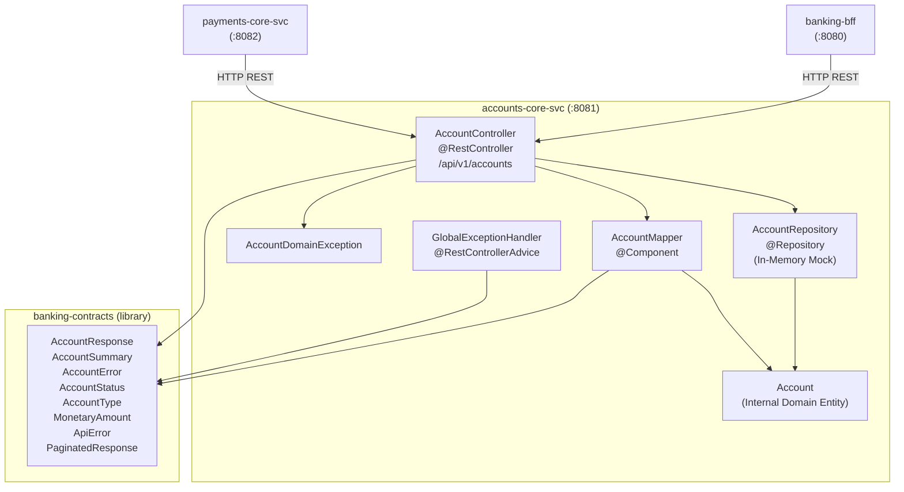
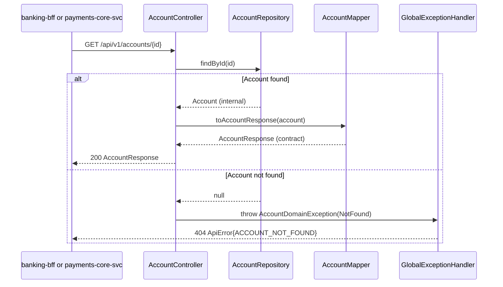

# System Architecture — accounts-core-svc

## System Overview

`accounts-core-svc` is a Spring Boot 3.3.5 / Kotlin 1.9.25 REST microservice running on port 8081. It is the **authoritative account data service** in the DigitalBank platform — both `banking-bff` and `payments-core-svc` call it to retrieve account data and validate account state.

The service currently uses an **in-memory repository** (mock store, 5 pre-seeded accounts) in place of a relational database. The codebase comments explicitly note this as a lab/practice implementation to be replaced with a JPA-backed repository for production.

There is **no authentication, no database, no Kafka, no outbound HTTP client, and no event publishing** in the current implementation.

---

## Architecture Diagram



Text Alternative:

```
[banking-bff :8080] ----+
                        |
[payments-core-svc :8082] --+
                            |
                            v
              +----------------------------------+
              |   accounts-core-svc (:8081)      |
              |                                  |
              |  [AccountController]             |
              |       |           |              |
              |       v           v              |
              | [AccountRepo] [AccountMapper]    |
              |       |           |              |
              |       v           v              |
              | [Account]   [AccountResponse     |
              | (internal)   AccountSummary]     |
              |                                  |
              | [GlobalExceptionHandler]         |
              |   -> ApiError (contracts)        |
              +----------------------------------+
                        |
                        v
              [In-Memory MutableMap]
              (5 seeded accounts — mock)
```

---

## Component Descriptions

### AccountController
- **Purpose**: HTTP REST controller for all account management operations
- **Responsibilities**: Route HTTP requests, enforce status invariants (FROZEN idempotency check), delegate to repository/mapper, throw `AccountDomainException` on errors
- **Dependencies**: `AccountRepository`, `AccountMapper`, `AccountDomainException`, contract types from banking-contracts
- **Type**: Application — Controller

### AccountRepository
- **Purpose**: Data access layer (currently in-memory mock)
- **Responsibilities**: `findAll()`, `findById()`, `save()` on internal `Account` entities; pre-seeded with 5 realistic test accounts
- **Dependencies**: `Account` domain entity
- **Type**: Application — Repository (mock)

### AccountMapper
- **Purpose**: Anti-corruption layer; sole authorized projector from internal domain to API contract types
- **Responsibilities**: `toAccountResponse()`, `toAccountSummary()`; ensures internal fields never leak to API boundary
- **Dependencies**: `Account` (internal), `AccountResponse`, `AccountSummary` (contracts)
- **Type**: Application — Mapper

### Account (domain entity)
- **Purpose**: Internal representation of a bank account with full operational state
- **Responsibilities**: Carries both public fields (id, type, balance, status) and internal fields (riskScore, kycVerified, createdBy)
- **Dependencies**: `AccountStatus`, `AccountType`, `MonetaryAmount` (from banking-contracts)
- **Type**: Application — Domain Entity

### AccountDomainException
- **Purpose**: Runtime wrapper that carries a typed `AccountError` through Spring's exception chain
- **Responsibilities**: Bridge between domain error type (sealed class) and Spring MVC exception handling
- **Dependencies**: `AccountError` (banking-contracts)
- **Type**: Application — Exception

### GlobalExceptionHandler
- **Purpose**: Centralized HTTP error mapping via `@RestControllerAdvice`
- **Responsibilities**: Maps `AccountDomainException` sub-types to HTTP status codes; maps all other exceptions to 500; always returns `ApiError` from banking-contracts; generates `traceId` via `UUID.randomUUID()` (not propagated from inbound request headers)
- **Dependencies**: `ApiError`, `AccountError` (banking-contracts)
- **Type**: Application — Exception Handler

---

## Data Flow



Text Alternative:

```
Caller -> Controller: GET /api/v1/accounts/{id}
Controller -> Repo: findById(id) -> Account?
  [found]   -> Mapper: toAccountResponse() -> AccountResponse -> 200
  [null]    -> throw AccountDomainException(NotFound)
              -> GlobalExceptionHandler -> 404 ApiError
```

---

## Integration Points

- **External APIs consumed**: None
- **Databases**: None (in-memory mock; production target is a relational database with JPA)
- **Message brokers**: None (no Kafka, no RabbitMQ)
- **Third-party services**: None

---

## Infrastructure Components

- **CDK/Terraform**: None
- **Deployment Model**: Spring Boot fat JAR; runs on JVM 17; port 8081
- **Networking**: Inbound HTTP only; no outbound connections currently configured
- **API Documentation**: SpringDoc OpenAPI — Swagger UI at `/swagger-ui.html`, JSON spec at `/api-docs`
