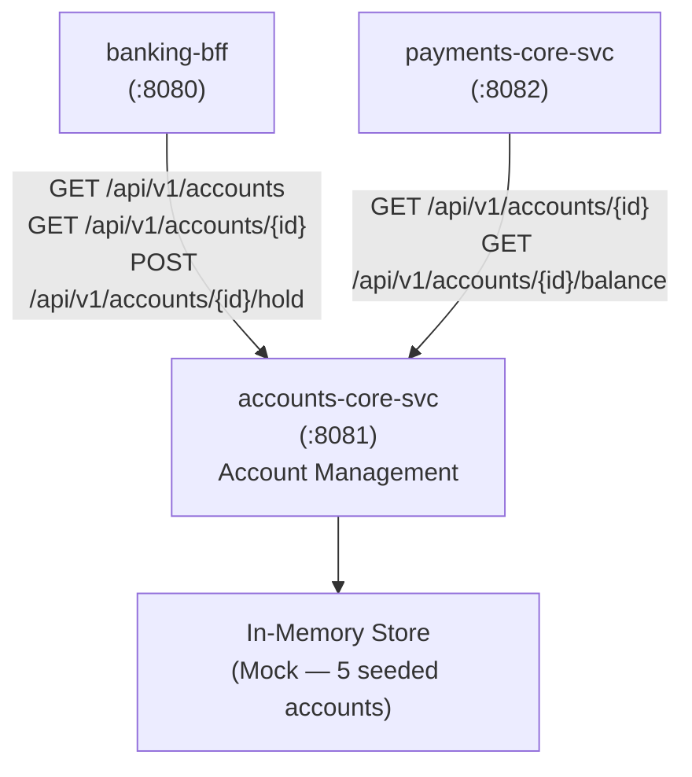

# Business Overview — accounts-core-svc

## Business Context Diagram



Text Alternative:

```
[banking-bff :8080]          [payments-core-svc :8082]
       |    \                         |
       |     \                        |
       v      v                       v
       [accounts-core-svc :8081]
              |
              v
       [In-Memory Map<String, Account>]
       (mock store — 5 pre-seeded accounts)
```

---

## Business Description

- **Business Description**: `accounts-core-svc` is the authoritative service for bank account management within the DigitalBank platform. It owns the lifecycle of account records, exposes account data to the BFF for customer-facing views, and acts as the account validation authority for the payments service. It enforces the business rule that frozen accounts cannot be mutated.

- **Business Transactions**:

  | Transaction | Endpoint | Description |
  |---|---|---|
  | List accounts (dashboard) | `GET /api/v1/accounts` | Returns paginated summary of all accounts for display |
  | View account detail | `GET /api/v1/accounts/{id}` | Returns full account record by ID |
  | Check account balance | `GET /api/v1/accounts/{id}/balance` | Returns current available balance for a specific account |
  | Place account hold | `POST /api/v1/accounts/{id}/hold` | Freezes an account — blocks all future debits and credits |

- **Business Dictionary**:

  | Term | Meaning in this service |
  |---|---|
  | Account | The internal domain entity (`Account` data class) — includes PII fields and internal operational data not exposed externally |
  | Hold | A freeze operation that transitions account status to FROZEN; idempotent check prevents double-freeze |
  | Risk Score | Internal integer score (`internalRiskScore`) — never exposed at API boundary |
  | KYC Verified | Internal boolean (`kycVerified`) indicating customer identity verification status — never exposed at API boundary |
  | Created By | Internal string (`createdBy`) indicating originating system/channel — never exposed at API boundary |

---

## Component Level Business Descriptions

### AccountController
- **Purpose**: HTTP entry point for all account operations; routes requests and enforces business invariants (e.g., cannot hold an already-frozen account)
- **Responsibilities**: Validate account existence, enforce status invariants, delegate to repository and mapper

### Account (domain entity)
- **Purpose**: Internal representation of a bank account; carries both public-facing data and internal operational fields
- **Responsibilities**: Holds the full account state including sensitive internal fields; never serialized directly to API responses

### AccountRepository
- **Purpose**: Data access layer; currently an in-memory mock pre-seeded with 5 realistic accounts
- **Responsibilities**: findAll, findById, save operations; mock stands in for a future JPA/database implementation

### AccountMapper
- **Purpose**: Anti-corruption layer at the API boundary — the sole component authorized to read internal Account fields
- **Responsibilities**: Projects `Account` → `AccountResponse` (detail) and `Account` → `AccountSummary` (list); enforces that `internalRiskScore`, `kycVerified`, `createdBy` are never included in any API response

### GlobalExceptionHandler
- **Purpose**: Centralized error-to-HTTP mapping using the shared `ApiError` contract type
- **Responsibilities**: Maps `AccountDomainException` (wrapping typed `AccountError`) to appropriate HTTP status codes and `ApiError` response bodies
