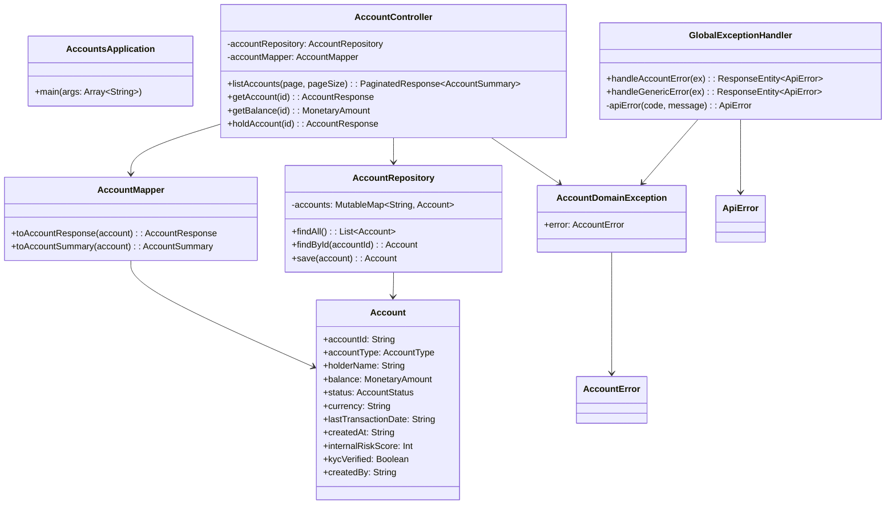

# Code Structure — accounts-core-svc

## Build System

- **Type**: Gradle (Kotlin DSL)
- **Gradle Version**: 8.5 (gradle-wrapper.properties)
- **Spring Boot Version**: 3.3.5
- **Kotlin Version**: 1.9.25
- **JVM Target**: 17

**build.gradle.kts highlights**:
```kotlin
plugins {
    id("org.springframework.boot") version "3.3.5"
    id("io.spring.dependency-management") version "1.1.6"
    kotlin("jvm") version "1.9.25"
    kotlin("plugin.spring") version "1.9.25"   // open classes for Spring proxies
}

dependencies {
    implementation("org.springframework.boot:spring-boot-starter-web")
    implementation("org.springframework.boot:spring-boot-starter-validation")  // Bean Validation on classpath; NOT yet used
    implementation("org.springdoc:springdoc-openapi-starter-webmvc-ui:2.6.0")
    implementation("com.fasterxml.jackson.module:jackson-module-kotlin")
    implementation("org.jetbrains.kotlin:kotlin-reflect")
    implementation("com.digitalbank:banking-contracts")   // ⚠ no version pinned
    testImplementation("org.springframework.boot:spring-boot-starter-test")
    testImplementation("org.jetbrains.kotlin:kotlin-test-junit5")
}

kotlin {
    compilerOptions { freeCompilerArgs.addAll("-Xjsr305=strict") }  // strict JSR-305 null-safety
}
```

**Artifact Coordinates**: `com.digitalbank:accounts-core-svc:0.0.1-SNAPSHOT`

---

## Package Hierarchy

```
com.digitalbank.accounts
├── AccountsApplication.kt           @SpringBootApplication entry point
├── controller/
│   └── AccountController.kt         @RestController — all HTTP routes
├── domain/
│   └── Account.kt                   Internal domain entity (NOT a JPA @Entity)
├── exception/
│   ├── AccountDomainException.kt    RuntimeException wrapper for AccountError
│   └── GlobalExceptionHandler.kt   @RestControllerAdvice — error-to-HTTP mapping
├── mapper/
│   └── AccountMapper.kt             @Component — domain → contract projection
└── repository/
    └── AccountRepository.kt         @Repository — in-memory MutableMap mock
```

---

## Key Classes/Modules



---

### Existing Files Inventory

- [accounts-core-svc/src/main/kotlin/com/digitalbank/accounts/AccountsApplication.kt](accounts-core-svc/src/main/kotlin/com/digitalbank/accounts/AccountsApplication.kt) — Spring Boot entry point; `@SpringBootApplication`; no customization
- [accounts-core-svc/src/main/kotlin/com/digitalbank/accounts/controller/AccountController.kt](accounts-core-svc/src/main/kotlin/com/digitalbank/accounts/controller/AccountController.kt) — 4 REST endpoints; pagination logic; status invariant check for hold operation; business logic is co-located in controller (no separate service layer)
- [accounts-core-svc/src/main/kotlin/com/digitalbank/accounts/domain/Account.kt](accounts-core-svc/src/main/kotlin/com/digitalbank/accounts/domain/Account.kt) — Internal domain entity; `data class` (not `@Entity`); 3 internal-only fields explicitly documented
- [accounts-core-svc/src/main/kotlin/com/digitalbank/accounts/exception/AccountDomainException.kt](accounts-core-svc/src/main/kotlin/com/digitalbank/accounts/exception/AccountDomainException.kt) — Thin `RuntimeException` wrapper carrying typed `AccountError`
- [accounts-core-svc/src/main/kotlin/com/digitalbank/accounts/exception/GlobalExceptionHandler.kt](accounts-core-svc/src/main/kotlin/com/digitalbank/accounts/exception/GlobalExceptionHandler.kt) — `@RestControllerAdvice`; exhaustive `when` on `AccountError` sealed subtypes; generic fallback handler; `traceId` generated via `UUID.randomUUID()` (not from request context)
- [accounts-core-svc/src/main/kotlin/com/digitalbank/accounts/mapper/AccountMapper.kt](accounts-core-svc/src/main/kotlin/com/digitalbank/accounts/mapper/AccountMapper.kt) — Two projection methods; sole authorized reader of internal `Account` fields; explicitly omits sensitive fields
- [accounts-core-svc/src/main/kotlin/com/digitalbank/accounts/repository/AccountRepository.kt](accounts-core-svc/src/main/kotlin/com/digitalbank/accounts/repository/AccountRepository.kt) — In-memory `MutableMap` mock; 5 pre-seeded accounts with realistic data; `findAll()` returns all (no DB-level pagination); self-documented as production placeholder
- [accounts-core-svc/src/main/resources/application.yml](accounts-core-svc/src/main/resources/application.yml) — Minimal config: port 8081, app name, SpringDoc paths only

---

## Design Patterns

### Anti-Corruption Layer (Mapper)
- **Location**: `AccountMapper.kt`
- **Purpose**: Enforces the boundary between the internal domain model and the public API contract — prevents internal field leakage
- **Implementation**: `@Component` with explicit `toAccountResponse()` and `toAccountSummary()` methods; internal fields are intentionally omitted; KDoc explicitly documents the authorization constraint

### Typed Domain Error Propagation
- **Location**: `AccountDomainException.kt`, `GlobalExceptionHandler.kt`
- **Purpose**: Bridges Kotlin sealed-class error handling with Spring MVC's exception handler chain
- **Implementation**: Controller throws `AccountDomainException(AccountError.*)` → caught by `@RestControllerAdvice` → exhaustive `when` maps each subtype to the correct HTTP status + `ApiError` body

### Projection DTOs
- **Location**: `AccountMapper.toAccountResponse()` vs `toAccountSummary()`
- **Purpose**: Different views of the same entity for different use cases (detail vs. list)
- **Implementation**: `toAccountSummary()` intentionally omits currency, lastTransactionDate, and all internal fields

---

## Critical Dependencies

### spring-boot-starter-validation
- **Version**: Managed by Spring Boot 3.3.5 BOM
- **Usage**: On classpath but **not yet applied** — no `@Valid`, `@Validated`, or field-level validation annotations exist on any controller method or DTO
- **Gap**: Dependency present but unused; input bounds not enforced at the API layer

### springdoc-openapi-starter-webmvc-ui
- **Version**: 2.6.0 (explicit)
- **Usage**: Auto-generates OpenAPI 3 spec from Spring MVC annotations; Swagger UI at `/swagger-ui.html`; `@Operation`, `@ApiResponse`, `@Tag` annotations used on all controller methods

### jackson-module-kotlin
- **Version**: Managed by Spring Boot BOM
- **Usage**: Enables Jackson to serialize/deserialize Kotlin data classes correctly (handles default parameters, null safety); used for HTTP response serialization of contract types

### banking-contracts
- **Version**: **Not pinned** — `implementation("com.digitalbank:banking-contracts")` with no version; resolved from `mavenLocal()` or dependency management
- **Gap**: Version-unpinned dependency; breaking changes in banking-contracts would not be caught at dependency declaration time
