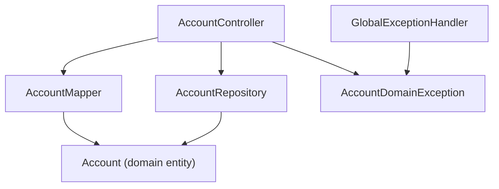

# Dependencies — accounts-core-svc

## Internal Dependencies



Text Alternative:

```
[AccountController]
    |       |       |
    v       v       v
[Mapper] [Repo] [AccountDomainException]
    |       |                |
    v       v                v
 [Domain] [Domain]   [GlobalExceptionHandler]
```

### Dependency Details (internal)

| From | To | Type | Reason |
|---|---|---|---|
| `AccountController` | `AccountRepository` | Compile | Data retrieval and persistence |
| `AccountController` | `AccountMapper` | Compile | Domain → contract projection |
| `AccountController` | `AccountDomainException` | Compile | Typed error throwing |
| `GlobalExceptionHandler` | `AccountDomainException` | Compile | Exception handling |
| `AccountMapper` | `Account` | Compile | Source entity for projection |
| `AccountRepository` | `Account` | Compile | Storage and retrieval entity |

---

## External Dependencies

| Dependency | Version | Scope | Purpose | License |
|---|---|---|---|---|
| `spring-boot-starter-web` | 3.3.5 (BOM) | implementation | Spring MVC REST framework, embedded Tomcat | Apache 2.0 |
| `spring-boot-starter-validation` | 3.3.5 (BOM) | implementation | Jakarta Bean Validation (on classpath, unused) | Apache 2.0 |
| `springdoc-openapi-starter-webmvc-ui` | 2.6.0 | implementation | OpenAPI 3 + Swagger UI auto-generation | Apache 2.0 |
| `jackson-module-kotlin` | (BOM) | implementation | Jackson Kotlin data class support | Apache 2.0 |
| `kotlin-reflect` | 1.9.25 | implementation | Spring class introspection | Apache 2.0 |
| `com.digitalbank:banking-contracts` | **UNPINNED** | implementation | Shared DTOs, error types, enums | Internal |
| `spring-boot-starter-test` | 3.3.5 (BOM) | testImplementation | JUnit 5, MockMvc, Mockito | Apache 2.0 |
| `kotlin-test-junit5` | 1.9.25 | testImplementation | Kotlin test DSL | Apache 2.0 |

---

## Dependency Resolution Notes

### banking-contracts — No Version Pinned
```kotlin
implementation("com.digitalbank:banking-contracts")  // no version
```
- **Resolution**: Depends on `mavenLocal()` (listed first in `repositories {}`) to find the artifact; falls back to `mavenCentral()` (where it does not exist)
- **Risk**: Any `publishToMavenLocal` of a breaking `banking-contracts` version silently overrides what this service resolves — no version guard
- **Production gap**: Requires a shared artifact repository (Nexus/Artifactory/GitHub Packages) with an explicit pinned version

### Spring Dependency Management (BOM)
- `io.spring.dependency-management:1.1.6` imports the Spring Boot 3.3.5 BOM, which aligns versions for all `spring-boot-starter-*`, Jackson, and Kotlin libraries
- No conflicts observed with explicitly versioned `springdoc:2.6.0`

### No Gradle Dependency Lock File
- Same finding as `banking-contracts`: no `gradle.lockfile` committed — transitive dependency graph is not reproducibly pinned (SECURITY-10)

---

## Interaction with Other Services

| Service | Direction | Mechanism | Endpoints Called |
|---|---|---|---|
| `banking-bff` | Inbound | HTTP REST | All 4 endpoints |
| `payments-core-svc` | Inbound | HTTP REST | `GET /api/v1/accounts/{id}`, `GET /api/v1/accounts/{id}/balance` |
| Any external service | Outbound | **None** | accounts-core-svc makes no outbound HTTP calls |
