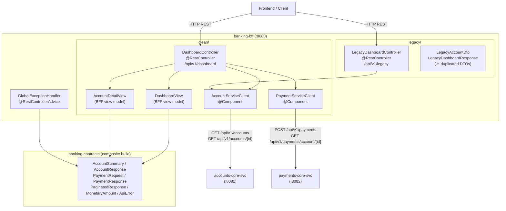

# System Architecture — banking-bff

## System Overview

`banking-bff` is a Spring Boot 3.3.5 / Kotlin 1.9.25 REST microservice running on port 8080. It is the **frontend aggregation layer** (Backend-for-Frontend) in the DigitalBank platform — it combines data from `accounts-core-svc` and `payments-core-svc` into unified views for the frontend client.

The service is architecturally organized into two distinct sub-packages that exist side-by-side as a **training contrast**:
- `clean/` — the reference implementation using shared banking-contracts types throughout
- `legacy/` — a deliberately bad example using locally-duplicated DTOs, documented as an anti-pattern

There is **no authentication, no database, no Kafka, no caching, no rate limiting, and no service discovery** in the current implementation. Both outbound service URLs are statically configured in `application.yml`.

---

## Architecture Diagram



Text Alternative:

```
[Frontend / Client]
       |
       v
+-----------------------------------------------+
|   banking-bff (:8080)                         |
|                                               |
|  [DashboardController] /api/v1/dashboard      |
|    |            |                             |
|    v            v                             |
| [AccountServiceClient] [PaymentServiceClient] |
|    |                        |                 |
|    v                        v                 |
| [accounts-core-svc]  [payments-core-svc]      |
|   :8081                 :8082                 |
|                                               |
|  [LegacyDashboardController] /api/v1/legacy   |
|   (uses AccountServiceClient + local DTOs)   |
|                                               |
|  [GlobalExceptionHandler]                     |
|   -> ApiError (banking-contracts)             |
+-----------------------------------------------+
```

---

## Component Descriptions

### DashboardController (clean)
- **Purpose**: Primary BFF aggregation controller; all data shapes from banking-contracts
- **Responsibilities**: `GET /api/v1/dashboard` (aggregate), `GET /api/v1/dashboard/accounts/{id}` (detail + history), `POST /api/v1/dashboard/transfer` (forward payment)
- **Dependencies**: `AccountServiceClient`, `PaymentServiceClient`, `DashboardView`, `AccountDetailView`, `PaymentRequest`, `PaymentResponse` from banking-contracts
- **Type**: Application — Controller (Clean Pattern)

### AccountServiceClient
- **Purpose**: WebClient adapter for `accounts-core-svc`
- **Responsibilities**: `listAccounts(page, pageSize)` → `PaginatedResponse<AccountSummary>`; `getAccount(id)` → `AccountResponse?`; null/empty returns on all error paths
- **Dependencies**: Spring WebFlux `WebClient`, `AccountResponse`, `AccountSummary`, `PaginatedResponse` from banking-contracts; `accounts-service.base-url` property
- **Type**: Application — HTTP Client

### PaymentServiceClient
- **Purpose**: WebClient adapter for `payments-core-svc`
- **Responsibilities**: `submitPayment(request)` → `PaymentResponse` (no error handling — propagates upstream exceptions); `getPaymentsByAccount(accountId)` → `List<PaymentResponse>` (returns empty list on error)
- **Dependencies**: Spring WebFlux `WebClient`, `PaymentRequest`, `PaymentResponse` from banking-contracts; `payments-service.base-url` property
- **Type**: Application — HTTP Client

### DashboardView
- **Purpose**: BFF-owned view model for the dashboard endpoint
- **Responsibilities**: Composes `List<AccountSummary>` + `List<PaymentResponse>` + `totalAccountCount: Int` — pure data container, no behavior
- **Dependencies**: `AccountSummary`, `PaymentResponse` from banking-contracts
- **Type**: Application — View Model (Clean Pattern)

### AccountDetailView
- **Purpose**: BFF-owned view model for the account detail endpoint
- **Responsibilities**: Composes `AccountResponse` + `List<PaymentResponse>` — pure data container
- **Dependencies**: `AccountResponse`, `PaymentResponse` from banking-contracts
- **Type**: Application — View Model (Clean Pattern)

### GlobalExceptionHandler
- **Purpose**: Centralized HTTP error mapping for unhandled exceptions
- **Responsibilities**: Maps `ResponseStatusException` (pass-through status code) and `WebClientResponseException` (upstream error code `UPSTREAM_ERROR`) to `ApiError`; generates `traceId` via `UUID.randomUUID()`
- **Dependencies**: `ApiError` from banking-contracts
- **Type**: Application — Exception Handler

### LegacyDashboardController (legacy / anti-pattern)
- **Purpose**: Training artifact demonstrating DTO duplication anti-pattern
- **Responsibilities**: `GET /api/v1/legacy/dashboard` — calls `AccountServiceClient.listAccounts()`, maps `AccountSummary` to `LegacyAccountDto` via manual field copy with type degradation
- **Dependencies**: `AccountServiceClient`, `LegacyAccountDto`, `LegacyDashboardResponse`
- **Type**: Application — Controller (Anti-Pattern Demo)

### LegacyAccountDto / LegacyDashboardResponse (legacy / anti-pattern)
- **Purpose**: Locally-duplicated DTOs that mirror banking-contracts types without reusing them
- **Responsibilities**: Mirror `AccountSummary` and `PaginatedResponse<AccountSummary>` with degraded types (`enum → String`, `MonetaryAmount → String`, `Long → Int`)
- **Type**: Application — DTO (Anti-Pattern Demo)

---

## Aggregation Patterns

### GET /api/v1/dashboard — Sequential Two-Service Call

```
Step 1: AccountServiceClient.listAccounts()  → accounts-core-svc GET /api/v1/accounts
Step 2: if accounts.items.isNotEmpty():
          PaymentServiceClient.getPaymentsByAccount(accounts.items.first().accountId)
          → payments-core-svc GET /api/v1/payments/account/{firstAccountId}
        else: emptyList()
Result: DashboardView(accounts.items, recentPayments, accounts.totalItems)
```

**Note**: Recent payments are only fetched for the **first account** in the list, not all accounts. This is a data completeness gap — the dashboard shows payments for only one account.

### GET /api/v1/dashboard/accounts/{id} — Sequential Two-Service Call

```
Step 1: AccountServiceClient.getAccount(id)  → accounts-core-svc GET /api/v1/accounts/{id}
        if null → throw ResponseStatusException(404)
Step 2: PaymentServiceClient.getPaymentsByAccount(id)
        → payments-core-svc GET /api/v1/payments/account/{id}
Result: AccountDetailView(account, recentPayments)
```

### POST /api/v1/dashboard/transfer — Single Pass-Through

```
Step 1: PaymentServiceClient.submitPayment(request)
        → payments-core-svc POST /api/v1/payments
Result: PaymentResponse (direct pass-through — no BFF transformation)
```

**Note**: No error handling in `PaymentServiceClient.submitPayment()` — upstream exceptions propagate to `GlobalExceptionHandler`.

---

## Integration Points

- **External APIs consumed**:
  - `accounts-core-svc` — `GET /api/v1/accounts` (paginated list), `GET /api/v1/accounts/{id}`
  - `payments-core-svc` — `POST /api/v1/payments`, `GET /api/v1/payments/account/{accountId}`
- **Databases**: None
- **Message brokers**: None
- **Authentication**: None
- **Caching**: None
- **Rate Limiting**: None
- **Service Discovery**: None (static URLs in `application.yml`)

---

## Infrastructure Components

- **CDK/Terraform**: None
- **Deployment Model**: Spring Boot fat JAR; runs on JVM 17; port 8080
- **Networking**: Inbound HTTP on port 8080; outbound HTTP to accounts-core-svc (:8081) and payments-core-svc (:8082)
- **API Documentation**: SpringDoc OpenAPI — Swagger UI at `/swagger-ui.html`, JSON spec at `/api-docs`
