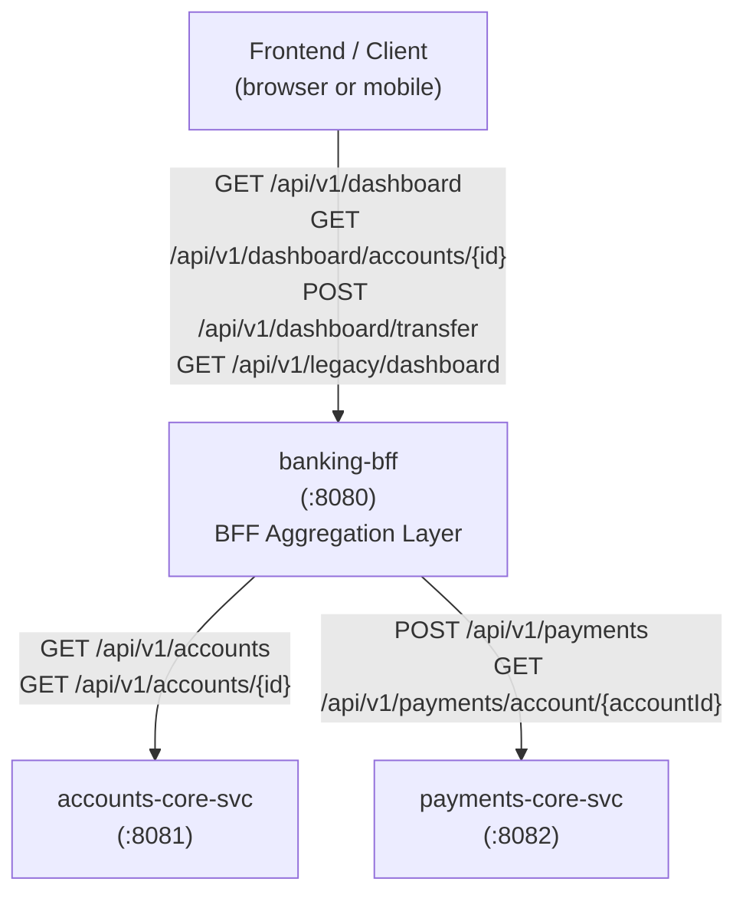

# Business Overview — banking-bff

## Business Context Diagram



Text Alternative:

```
[Frontend / Client]
       |
       v
[banking-bff :8080]
  |                  |
  v                  v
[accounts-core-svc :8081]   [payments-core-svc :8082]
  GET /api/v1/accounts          POST /api/v1/payments
  GET /api/v1/accounts/{id}     GET /api/v1/payments/account/{id}
```

---

## Business Description

- **Business Description**: `banking-bff` (Backend-for-Frontend) is the unified API gateway for the DigitalBank frontend. It aggregates account and payment data from the core services into frontend-optimized views, shielding the frontend from the internal service topology. It is the single entry point for all customer-facing data operations: viewing account dashboards, drilling into account details with payment history, and submitting transfers.

  The codebase deliberately includes a **side-by-side contrast** of two implementation patterns:
  - **Clean Pattern** (`/api/v1/dashboard`): Uses shared contract types from `banking-contracts` directly — no field duplication, no manual mapping.
  - **Legacy/Anti-Pattern Demo** (`/api/v1/legacy`): Uses locally-duplicated DTOs — explicitly labeled as an anti-pattern for training purposes.

- **Business Transactions**:

  | Transaction | Endpoint | Description |
  |---|---|---|
  | Load dashboard | `GET /api/v1/dashboard` | Aggregates account list + recent payments for first account into a single frontend view |
  | View account detail | `GET /api/v1/dashboard/accounts/{id}` | Returns full account details enriched with the account's payment history |
  | Submit a transfer | `POST /api/v1/dashboard/transfer` | Forwards a `PaymentRequest` to `payments-core-svc` and returns the `PaymentResponse` |
  | Load legacy dashboard | `GET /api/v1/legacy/dashboard` | Anti-pattern demo endpoint — returns locally-duplicated DTOs instead of contract types |

- **Business Dictionary**:

  | Term | Meaning in this service |
  |---|---|
  | DashboardView | BFF-owned view model composing `List<AccountSummary>` + `List<PaymentResponse>` + `totalAccountCount` |
  | AccountDetailView | BFF-owned view model composing `AccountResponse` + `List<PaymentResponse>` |
  | Clean Pattern | Implementation approach: all data shapes sourced from `banking-contracts`; no BFF-owned DTOs for data fields |
  | Anti-Pattern / Legacy | Deliberately bad example: locally-duplicated DTOs that mirror contract types, requiring manual mapping and creating silent drift risk |
  | LegacyAccountDto | Duplicated local DTO mirroring `AccountSummary` — used only in the anti-pattern demo |
  | LegacyDashboardResponse | Duplicated local wrapper mirroring `PaginatedResponse<AccountSummary>` — used only in the anti-pattern demo |

---

## Component Level Business Descriptions

### DashboardController (Clean)
- **Purpose**: Primary BFF aggregation controller; exposes frontend-optimized views by orchestrating calls to both core services
- **Responsibilities**: Dashboard aggregation (accounts + payments), account detail enrichment (account + payment history), payment submission forwarding

### AccountServiceClient
- **Purpose**: HTTP adapter for `accounts-core-svc`; encapsulates all account-related upstream calls
- **Responsibilities**: `listAccounts()` (paginated), `getAccount(id)` — graceful null/empty returns on failure

### PaymentServiceClient
- **Purpose**: HTTP adapter for `payments-core-svc`; encapsulates all payment-related upstream calls
- **Responsibilities**: `submitPayment()`, `getPaymentsByAccount()` — direct pass-through of contract types

### GlobalExceptionHandler
- **Purpose**: Translate unhandled Spring exceptions and upstream HTTP errors into `ApiError` responses for the frontend
- **Responsibilities**: Map `ResponseStatusException` and `WebClientResponseException` to typed `ApiError` with trace IDs

### LegacyDashboardController (Anti-Pattern Demo)
- **Purpose**: Training artifact demonstrating the DTO duplication anti-pattern
- **Responsibilities**: Returns locally-mapped `LegacyDashboardResponse` using manually-copied fields from `AccountSummary`; explicitly documented as the wrong approach
