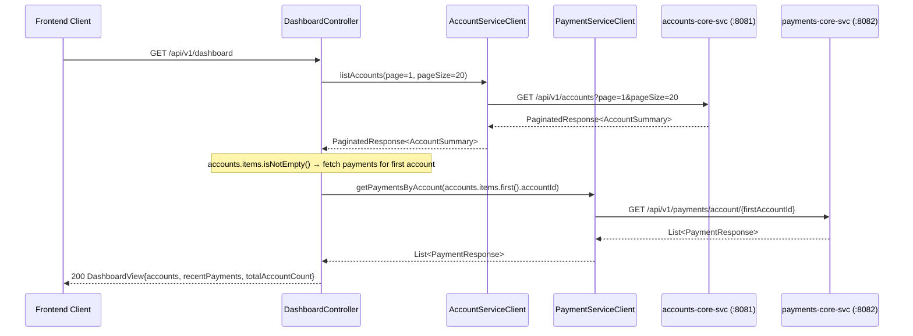
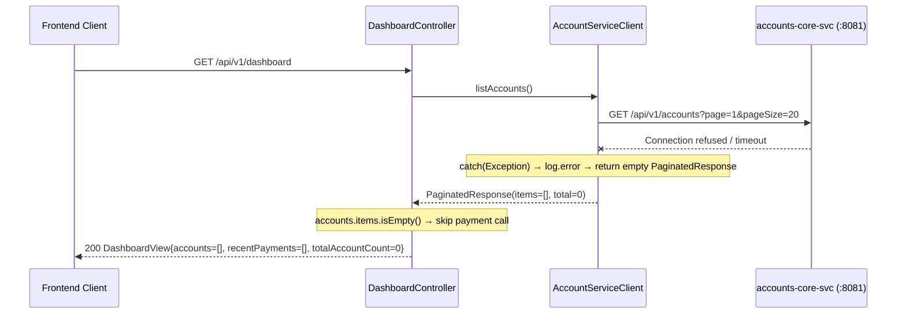
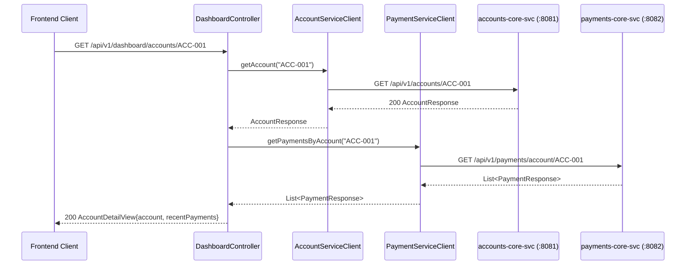
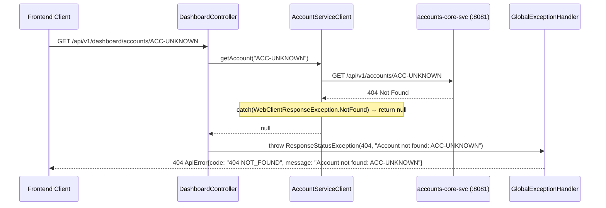
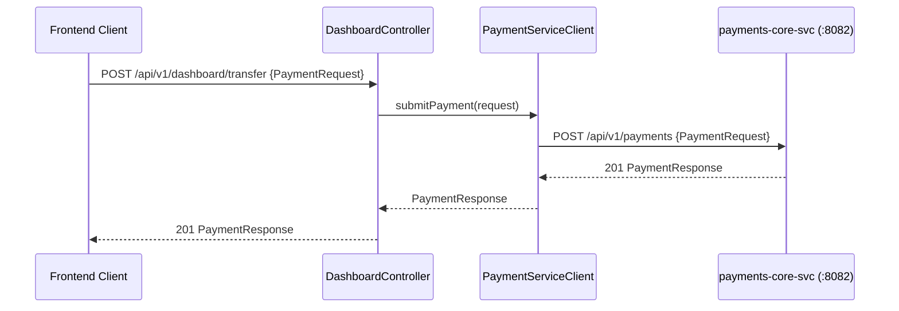
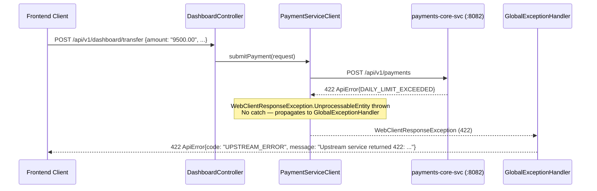
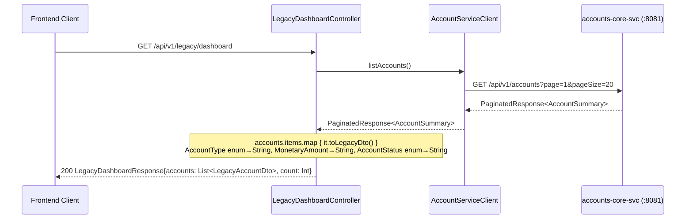

# Interaction Diagrams — banking-bff

## Overview

`banking-bff` participates in three cross-service interaction patterns:
1. **Inbound**: Receives HTTP calls from the frontend client
2. **Outbound to accounts-core-svc**: Account list and account detail retrieval
3. **Outbound to payments-core-svc**: Payment submission and payment history retrieval

All aggregation calls are **sequential**, not parallel.

---

## Interaction 1: GET /api/v1/dashboard (Happy Path)



Text Alternative:

```
FE -> DashboardController: GET /api/v1/dashboard
  [Step 1 - sequential]
  AccountServiceClient.listAccounts(page=1, pageSize=20)
  -> accounts-svc: GET /api/v1/accounts?page=1&pageSize=20
  <- PaginatedResponse<AccountSummary>

  [Step 2 - sequential, only if accounts.items non-empty]
  PaymentServiceClient.getPaymentsByAccount(accounts.items[0].accountId)
  -> payments-svc: GET /api/v1/payments/account/{firstAccountId}
  <- List<PaymentResponse>

  <- 200 DashboardView{accounts, recentPayments, totalAccountCount}

NOTE: recentPayments contains payments for the FIRST account only.
      No parallel calls — full round-trip latency = accounts RTT + payments RTT.
```

---

## Interaction 2: GET /api/v1/dashboard — accounts-core-svc Unavailable



Text Alternative:

```
FE -> DashboardController: GET /api/v1/dashboard
  AccountServiceClient.listAccounts()
  -> accounts-svc: GET /api/v1/accounts -> Exception
  catch(Exception) -> log.error -> return PaginatedResponse([], 1, 20, 0L, 0)
  accounts.items.isEmpty() -> skip payment call
  <- 200 DashboardView{accounts=[], recentPayments=[], totalAccountCount=0}

NOTE: Frontend receives a successful 200 response with empty data.
      No error surfaced — upstream failure is silently swallowed.
```

---

## Interaction 3: GET /api/v1/dashboard/accounts/{id} (Happy Path)



Text Alternative:

```
FE -> DashboardController: GET /api/v1/dashboard/accounts/ACC-001
  [Step 1] AccountServiceClient.getAccount("ACC-001")
  -> accounts-svc: GET /api/v1/accounts/ACC-001
  <- AccountResponse

  [Step 2] PaymentServiceClient.getPaymentsByAccount("ACC-001")
  -> payments-svc: GET /api/v1/payments/account/ACC-001
  <- List<PaymentResponse>

  <- 200 AccountDetailView{account, recentPayments}
```

---

## Interaction 4: GET /api/v1/dashboard/accounts/{id} — Account Not Found



Text Alternative:

```
FE -> DashboardController: GET /api/v1/dashboard/accounts/ACC-UNKNOWN
  AccountServiceClient.getAccount("ACC-UNKNOWN")
  -> accounts-svc: GET /api/v1/accounts/ACC-UNKNOWN -> 404
  catch(NotFound) -> null
  <- null
  throw ResponseStatusException(404, "Account not found: ACC-UNKNOWN")
GlobalExceptionHandler: 404 ApiError{code: "404 NOT_FOUND"}
```

---

## Interaction 5: POST /api/v1/dashboard/transfer (Happy Path)



Text Alternative:

```
FE -> DashboardController: POST /api/v1/dashboard/transfer {PaymentRequest}
  PaymentServiceClient.submitPayment(request)
  -> payments-svc: POST /api/v1/payments {PaymentRequest}
  <- 201 PaymentResponse
  <- 201 PaymentResponse (direct pass-through, no BFF transformation)
```

---

## Interaction 6: POST /api/v1/dashboard/transfer — Upstream Error (Daily Limit)



Text Alternative:

```
FE -> DashboardController: POST /api/v1/dashboard/transfer {amount: "9500.00"}
  PaymentServiceClient.submitPayment(request)
  -> payments-svc: POST /api/v1/payments -> 422 ApiError{DAILY_LIMIT_EXCEEDED}
  WebClientResponseException(422) thrown — no catch in submitPayment()
  GlobalExceptionHandler: 422 ApiError{code: "UPSTREAM_ERROR"}

NOTE: The typed PaymentError domain information (DAILY_LIMIT_EXCEEDED, limit amount)
      is lost. Frontend only receives "UPSTREAM_ERROR" regardless of domain error type.
```

---

## Interaction 7: GET /api/v1/legacy/dashboard (Anti-Pattern Demo)



Text Alternative:

```
FE -> LegacyDashboardController: GET /api/v1/legacy/dashboard
  AccountServiceClient.listAccounts()
  -> accounts-svc: GET /api/v1/accounts?page=1&pageSize=20
  <- PaginatedResponse<AccountSummary>
  accounts.items.map { toLegacyDto() }
    accountType: AccountType → String (type degradation)
    balance: MonetaryAmount → "500.00 USD" String (lossy)
    status: AccountStatus → String (type degradation)
    totalItems: Long → count: Int (overflow risk)
  <- 200 LegacyDashboardResponse{accounts, count}
```
