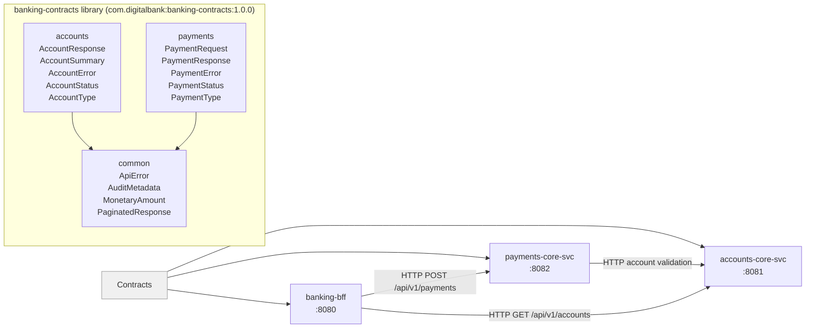
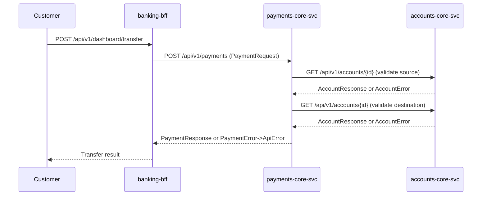

# System Architecture — banking-contracts

## System Overview

`banking-contracts` is a Kotlin JVM library that establishes the shared type system for the DigitalBank multi-service platform. It has no runtime presence — it is a compile-time and runtime classpath dependency consumed by three services. Its architectural role is that of a **contract package** in a Domain-Driven Design multi-repo setup: it defines the API boundary types for two bounded contexts (Accounts, Payments) and a common cross-cutting layer.

The library is published as a Maven artifact (`com.digitalbank:banking-contracts:1.0.0`) and consumed via Gradle dependency declarations.

---

## Architecture Diagram



Text Alternative:

```
+---------------------------------------------+
|  banking-contracts (shared library)          |
|                                              |
|  +----------+  +----------+  +----------+   |
|  | common   |  | accounts |  | payments |   |
|  | ApiError |  | Response |  | Request  |   |
|  | Monetary |  | Summary  |  | Response |   |
|  | Audit    |  | Error    |  | Error    |   |
|  | Paginated|  | Status   |  | Status   |   |
|  +----------+  | Type     |  | Type     |   |
|                +-----+----+  +----+-----+   |
|                      |            |          |
|                      v            v          |
|                   [common]    [common]       |
+---------------------------------------------+
       |                |               |
       v                v               v
[accounts-core-svc] [payments-core-svc] [banking-bff]
    :8081               :8082            :8080
       ^                  |
       |__________________| (account validation calls)
```

---

## Component Descriptions

### common package
- **Purpose**: Platform-wide cross-cutting types shared by all bounded contexts
- **Responsibilities**: Error envelope, monetary value, audit metadata, pagination
- **Dependencies**: None (self-contained)
- **Type**: Shared/Common

### accounts package
- **Purpose**: Contract types for the Account Management bounded context
- **Responsibilities**: Account detail and list response projections, domain errors, lifecycle and product enumerations
- **Dependencies**: `common.MonetaryAmount` (for balance representation)
- **Type**: Domain Contract

### payments package
- **Purpose**: Contract types for the Payment Processing bounded context
- **Responsibilities**: Payment request/response models, domain errors, lifecycle and classification enumerations
- **Dependencies**: `common.MonetaryAmount` (for amount representation)
- **Type**: Domain Contract

---

## Data Flow



Text Alternative:

```
Customer -> BFF: POST /dashboard/transfer
BFF -> PaySvc: POST /payments [PaymentRequest]
PaySvc -> AccSvc: GET /accounts/{fromId} [validate]
AccSvc -> PaySvc: AccountResponse | AccountError
PaySvc -> AccSvc: GET /accounts/{toId} [validate]
AccSvc -> PaySvc: AccountResponse | AccountError
PaySvc -> BFF: PaymentResponse | ApiError
BFF -> Customer: result
```

---

## Integration Points

- **External APIs**: None — this library is consumed internally only
- **Databases**: None — library has no persistence layer
- **Third-party Services**: None — single runtime dependency is `kotlinx-serialization-json`

---

## Infrastructure Components

- **CDK Stacks**: None — library only, no deployment artifact
- **Deployment Model**: Published as Maven artifact; consumed as Gradle dependency by each service
- **Networking**: N/A — no runtime component
