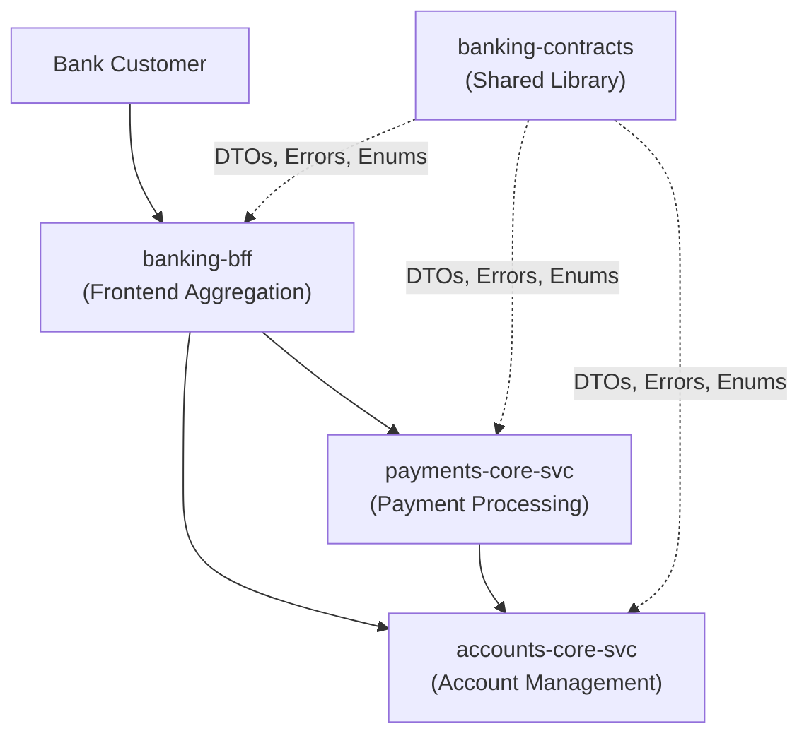

# Business Overview — banking-contracts

## Business Context Diagram



Text Alternative:

```
[Bank Customer]
       |
       v
[banking-bff: Frontend Aggregation :8080]
       |              |
       v              v
[accounts-core-svc  [payments-core-svc
 :8081]              :8082]
       ^                    |
       |____________________|
              |
       [accounts-core-svc called for account validation]

[banking-contracts] -.-> (shared library dependency for all three services)
```

---

## Business Description

- **Business Description**: `banking-contracts` is the shared contract library of a digital banking platform. It defines the canonical API boundary types — request/response DTOs, domain error hierarchies, enumerations, and cross-cutting value objects — used by all runtime services. It enforces a consistent data model across the bounded contexts of Account Management and Payment Processing, ensuring that all services speak the same language at the API boundary.

- **Business Transactions**: The library provides types that implement the following business transactions:

  | Transaction | Types Used |
  |---|---|
  | View account list (dashboard) | `AccountSummary`, `PaginatedResponse`, `AccountType`, `AccountStatus` |
  | View account detail | `AccountResponse`, `AccountType`, `AccountStatus`, `MonetaryAmount` |
  | Place account hold | `AccountResponse`, `AccountError.AccountFrozen` |
  | Initiate payment / fund transfer | `PaymentRequest`, `PaymentResponse`, `PaymentType`, `PaymentError` |
  | Query payment status | `PaymentResponse`, `PaymentStatus` |
  | View payment history | `PaymentResponse`, `PaginatedResponse`, `PaymentType`, `PaymentStatus` |
  | Error handling (all operations) | `ApiError` |
  | Audit trail (change tracking) | `AuditMetadata` |

- **Business Dictionary**:

  | Term | Meaning |
  |---|---|
  | Account | A bank account held by a customer; may be CHECKING, SAVINGS, or MONEY_MARKET |
  | Payment | A financial transfer instruction between two accounts, classified by type |
  | Monetary Amount | A financial quantity expressed as a decimal string + ISO 4217 currency code |
  | Account Status | Operational lifecycle state: ACTIVE, DORMANT, FROZEN, CLOSED |
  | Payment Status | Payment lifecycle: PENDING → COMPLETED / FAILED / CANCELLED |
  | Hold | A freeze placed on an account preventing all debits and credits |
  | Daily Limit | Per-account maximum cumulative payment amount within a 24-hour window |
  | Trace ID | Distributed tracing identifier for correlating logs across services |

---

## Component Level Business Descriptions

### banking-contracts (this library)
- **Purpose**: Acts as the single source of truth for the inter-service API contract. Defines what data flows between services, what errors are possible, and how values are represented.
- **Responsibilities**: Define all shared DTOs; define domain error types per bounded context; provide common value objects (MonetaryAmount, ApiError, AuditMetadata, PaginatedResponse); enforce serialization compatibility via kotlinx-serialization.

### accounts bounded context (types defined here, owned by accounts-core-svc)
- **Purpose**: Represents account product information visible to consumers of the account API.
- **Responsibilities**: Account lifecycle states (AccountStatus), product types (AccountType), account detail projection (AccountResponse), list view (AccountSummary), domain errors (AccountError).

### payments bounded context (types defined here, owned by payments-core-svc)
- **Purpose**: Represents payment operations from initiation through to terminal state.
- **Responsibilities**: Payment instruction model (PaymentRequest), payment record (PaymentResponse), payment lifecycle (PaymentStatus), payment classification (PaymentType), domain errors (PaymentError).

### common (cross-cutting concerns)
- **Purpose**: Platform-wide reusable types that apply across both bounded contexts and all services.
- **Responsibilities**: Standardized error envelope (ApiError), monetary representation (MonetaryAmount), audit tracking (AuditMetadata), paginated list wrapper (PaginatedResponse).
