# Code Structure — banking-contracts

## Build System

- **Type**: Gradle (Kotlin DSL)
- **Gradle Version**: 8.5 (from gradle-wrapper.properties)
- **JVM Target**: 17
- **Configuration Files**:
  - `build.gradle.kts` — plugin declarations, dependencies, publishing config
  - `settings.gradle.kts` — root project name (`banking-contracts`)
  - `gradle/wrapper/gradle-wrapper.properties` — Gradle wrapper pin

**build.gradle.kts Summary**:
```kotlin
plugins {
    kotlin("jvm") version "1.9.25"
    kotlin("plugin.serialization") version "1.9.25"
    `maven-publish`
}

group = "com.digitalbank"
version = "1.0.0"

dependencies {
    implementation("org.jetbrains.kotlinx:kotlinx-serialization-json:1.6.3")
}

kotlin { jvmToolchain(17) }

publishing {
    publications {
        create<MavenPublication>("maven") {
            from(components["java"])
            groupId = "com.digitalbank"
            artifactId = "banking-contracts"
            version = "1.0.0"
        }
    }
}
```

**Published Artifact Coordinates**: `com.digitalbank:banking-contracts:1.0.0`

---

## Key Classes/Modules

### Package Hierarchy

```mermaid
classDiagram
    namespace common {
        class ApiError {
            +code: String
            +message: String
            +traceId: String
            +timestamp: String
        }
        class AuditMetadata {
            +createdAt: String
            +updatedAt: String
            +version: Long
        }
        class MonetaryAmount {
            +amount: String
            +currency: String
        }
        class PaginatedResponse~T~ {
            +items: List~T~
            +page: Int
            +pageSize: Int
            +totalItems: Long
            +totalPages: Int
        }
    }
    namespace accounts {
        class AccountResponse {
            +accountId: String
            +accountType: AccountType
            +holderName: String
            +balance: MonetaryAmount
            +status: AccountStatus
            +currency: String
            +lastTransactionDate: String
            +createdAt: String
        }
        class AccountSummary {
            +accountId: String
            +accountType: AccountType
            +holderName: String
            +balance: MonetaryAmount
            +status: AccountStatus
            +openedAt: String
        }
        class AccountError {
            <<sealed>>
        }
        class AccountStatus {
            <<enum>>
            ACTIVE
            DORMANT
            FROZEN
            CLOSED
        }
        class AccountType {
            <<enum>>
            CHECKING
            SAVINGS
            MONEY_MARKET
        }
    }
    namespace payments {
        class PaymentRequest {
            +fromAccountId: String
            +toAccountId: String
            +amount: MonetaryAmount
            +type: PaymentType
            +reference: String
        }
        class PaymentResponse {
            +paymentId: String
            +fromAccountId: String
            +toAccountId: String
            +amount: MonetaryAmount
            +type: PaymentType
            +status: PaymentStatus
            +reference: String
            +createdAt: String
        }
        class PaymentError {
            <<sealed>>
        }
        class PaymentStatus {
            <<enum>>
            PENDING
            COMPLETED
            FAILED
            CANCELLED
        }
        class PaymentType {
            <<enum>>
            INTERNAL_TRANSFER
            BILL_PAYMENT
            SCHEDULED
        }
    }

    AccountResponse --> MonetaryAmount
    AccountResponse --> AccountType
    AccountResponse --> AccountStatus
    AccountSummary --> MonetaryAmount
    AccountSummary --> AccountType
    AccountSummary --> AccountStatus
    PaymentRequest --> MonetaryAmount
    PaymentRequest --> PaymentType
    PaymentResponse --> MonetaryAmount
    PaymentResponse --> PaymentType
    PaymentResponse --> PaymentStatus
```



---

### Existing Files Inventory

**common package** — `src/main/kotlin/com/digitalbank/contracts/common/`

- [banking-contracts/src/main/kotlin/com/digitalbank/contracts/common/ApiError.kt](banking-contracts/src/main/kotlin/com/digitalbank/contracts/common/ApiError.kt) — Standard error envelope for all API error responses; returned by GlobalExceptionHandler on all services
- [banking-contracts/src/main/kotlin/com/digitalbank/contracts/common/AuditMetadata.kt](banking-contracts/src/main/kotlin/com/digitalbank/contracts/common/AuditMetadata.kt) — Audit fields (createdAt, updatedAt, version) for optimistic locking support
- [banking-contracts/src/main/kotlin/com/digitalbank/contracts/common/MonetaryAmount.kt](banking-contracts/src/main/kotlin/com/digitalbank/contracts/common/MonetaryAmount.kt) — Monetary value with decimal-string precision (avoids floating-point errors)
- [banking-contracts/src/main/kotlin/com/digitalbank/contracts/common/PaginatedResponse.kt](banking-contracts/src/main/kotlin/com/digitalbank/contracts/common/PaginatedResponse.kt) — Generic paginated list wrapper for all list endpoints

**accounts package** — `src/main/kotlin/com/digitalbank/contracts/accounts/`

- [banking-contracts/src/main/kotlin/com/digitalbank/contracts/accounts/AccountError.kt](banking-contracts/src/main/kotlin/com/digitalbank/contracts/accounts/AccountError.kt) — Sealed class domain error hierarchy for account operations (NotFound, InsufficientFunds, AccountFrozen)
- [banking-contracts/src/main/kotlin/com/digitalbank/contracts/accounts/AccountResponse.kt](banking-contracts/src/main/kotlin/com/digitalbank/contracts/accounts/AccountResponse.kt) — Full account detail DTO for GET /accounts/{id} and POST /accounts/{id}/hold
- [banking-contracts/src/main/kotlin/com/digitalbank/contracts/accounts/AccountStatus.kt](banking-contracts/src/main/kotlin/com/digitalbank/contracts/accounts/AccountStatus.kt) — Account lifecycle enum (ACTIVE, DORMANT, FROZEN, CLOSED)
- [banking-contracts/src/main/kotlin/com/digitalbank/contracts/accounts/AccountSummary.kt](banking-contracts/src/main/kotlin/com/digitalbank/contracts/accounts/AccountSummary.kt) — Lightweight account DTO for list views / dashboard
- [banking-contracts/src/main/kotlin/com/digitalbank/contracts/accounts/AccountType.kt](banking-contracts/src/main/kotlin/com/digitalbank/contracts/accounts/AccountType.kt) — Account product enum (CHECKING, SAVINGS, MONEY_MARKET)

**payments package** — `src/main/kotlin/com/digitalbank/contracts/payments/`

- [banking-contracts/src/main/kotlin/com/digitalbank/contracts/payments/PaymentError.kt](banking-contracts/src/main/kotlin/com/digitalbank/contracts/payments/PaymentError.kt) — Sealed class domain error hierarchy for payment operations (InsufficientFunds, InvalidAccount, DailyLimitExceeded)
- [banking-contracts/src/main/kotlin/com/digitalbank/contracts/payments/PaymentRequest.kt](banking-contracts/src/main/kotlin/com/digitalbank/contracts/payments/PaymentRequest.kt) — Payment initiation DTO produced by banking-bff, consumed by payments-core-svc
- [banking-contracts/src/main/kotlin/com/digitalbank/contracts/payments/PaymentResponse.kt](banking-contracts/src/main/kotlin/com/digitalbank/contracts/payments/PaymentResponse.kt) — Canonical payment record DTO for all payment endpoints
- [banking-contracts/src/main/kotlin/com/digitalbank/contracts/payments/PaymentStatus.kt](banking-contracts/src/main/kotlin/com/digitalbank/contracts/payments/PaymentStatus.kt) — Payment lifecycle enum (PENDING → COMPLETED/FAILED/CANCELLED)
- [banking-contracts/src/main/kotlin/com/digitalbank/contracts/payments/PaymentType.kt](banking-contracts/src/main/kotlin/com/digitalbank/contracts/payments/PaymentType.kt) — Payment operation classification enum (INTERNAL_TRANSFER, BILL_PAYMENT, SCHEDULED)

---

## Design Patterns

### Sealed Class Error Domain
- **Location**: `AccountError.kt`, `PaymentError.kt`
- **Purpose**: Typed, exhaustive error handling — compels consumers to handle all error cases at compile time via `when` expressions
- **Implementation**: Each bounded context has a `sealed class *Error` with `data class` sub-types carrying contextual fields; not `@Serializable` — mapped to `ApiError` by GlobalExceptionHandler before serialization

### Projection DTOs (Full vs. Summary)
- **Location**: `AccountResponse.kt` vs `AccountSummary.kt`
- **Purpose**: Separate payload sizes for detail vs. list use cases; prevents over-fetching on dashboard list views
- **Implementation**: `AccountSummary` omits transaction history, audit metadata, and currency detail fields present in `AccountResponse`

### Decimal-String Monetary Representation
- **Location**: `MonetaryAmount.kt`
- **Purpose**: Financial precision — eliminates IEEE 754 floating-point rounding errors for monetary values
- **Implementation**: `amount` field typed as `String` (e.g., `"1234.56"`) rather than `Double` or `BigDecimal`; consumers parse to `BigDecimal` for arithmetic

### Generic Pagination Wrapper
- **Location**: `PaginatedResponse.kt`
- **Purpose**: Consistent pagination envelope across all list endpoints in the platform
- **Implementation**: Generic `data class PaginatedResponse<T>` with 1-based page numbering; `totalItems: Long` for large result sets

---

## Critical Dependencies

### kotlinx-serialization-json
- **Version**: 1.6.3
- **Usage**: All `@Serializable` data classes and enums; JSON serialization/deserialization at API boundary
- **Purpose**: Kotlin-native serialization without reflection overhead; required by Kotlin multiplatform targets if needed in future

### kotlin-plugin.serialization
- **Version**: 1.9.25 (matches Kotlin compiler)
- **Usage**: Compile-time code generation for `@Serializable` types (generates `$serializer` companion objects)
- **Purpose**: Enables `@Serializable` annotation processing; must match Kotlin version exactly
