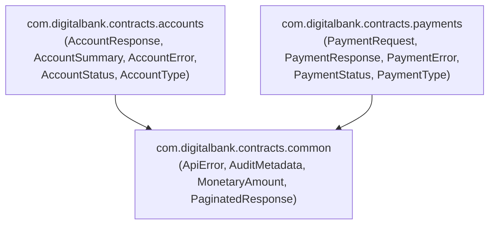

# Dependencies — banking-contracts

## Internal Dependencies



Text Alternative:

```
[common package]          (no internal deps)
      ^         ^
      |         |
[accounts]   [payments]
```

### accounts depends on common
- **Type**: Compile
- **Reason**: `AccountResponse` and `AccountSummary` embed `MonetaryAmount` for balance fields. `AccountError.InsufficientFunds` carries `MonetaryAmount` for requested/available amounts.

### payments depends on common
- **Type**: Compile
- **Reason**: `PaymentRequest` and `PaymentResponse` embed `MonetaryAmount` for the transfer amount. `PaymentError.InsufficientFunds` and `PaymentError.DailyLimitExceeded` carry `MonetaryAmount` fields.

### payments does NOT depend on accounts
- Note: `PaymentError` duplicates an `InsufficientFunds` variant rather than reusing `AccountError.InsufficientFunds`. The bounded contexts are intentionally decoupled at the contract level; cross-context error referencing is done by `payments-core-svc` consuming `AccountError` at the service layer (not in this library).

---

## External Dependencies

| Dependency | Version | Purpose | Scope | License |
|---|---|---|---|---|
| `org.jetbrains.kotlinx:kotlinx-serialization-json` | 1.6.3 | JSON serialization/deserialization for `@Serializable` types | `implementation` (runtime) | Apache 2.0 |
| `org.jetbrains.kotlin:kotlin-stdlib` | 1.9.25 (transitive) | Kotlin standard library | Transitive via kotlin-jvm plugin | Apache 2.0 |

**No test dependencies** — no test framework configured.

---

## Dependency Versioning Notes

- **No Gradle version catalog** (`libs.versions.toml`) detected — versions are hardcoded in `build.gradle.kts`.
- **No dependency lock file** (`gradle.lockfile`) — Gradle dependency locking is not enabled. This means transitive dependency resolution is not reproducibly pinned. This is a supply chain security finding (SECURITY-10).
- **No BOM (Bill of Materials)** imported — version alignment across kotlinx libraries is manual.

---

## Consuming Services (Expected Gradle Dependencies)

Based on KDoc annotations in the source, the following services declare this library as a dependency:

```kotlin
// Expected in accounts-core-svc/build.gradle.kts
implementation("com.digitalbank:banking-contracts:1.0.0")

// Expected in payments-core-svc/build.gradle.kts
implementation("com.digitalbank:banking-contracts:1.0.0")

// Expected in banking-bff/build.gradle.kts
implementation("com.digitalbank:banking-contracts:1.0.0")
```

**Dependency resolution**: Services must either publish `banking-contracts` to a local Maven repository (e.g., `mavenLocal()`) or a shared artifact repository (Nexus, Artifactory, GitHub Packages) for `implementation` resolution to work in CI/CD environments.
