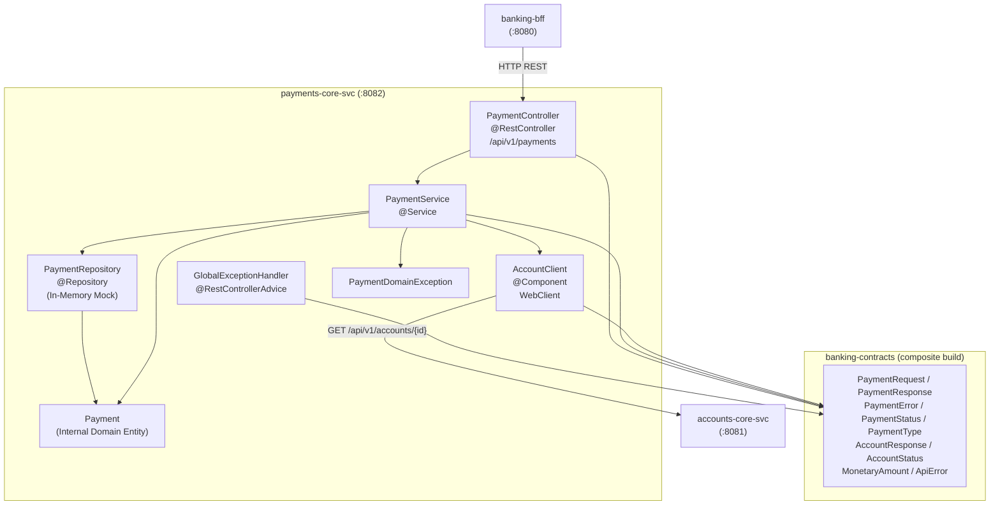
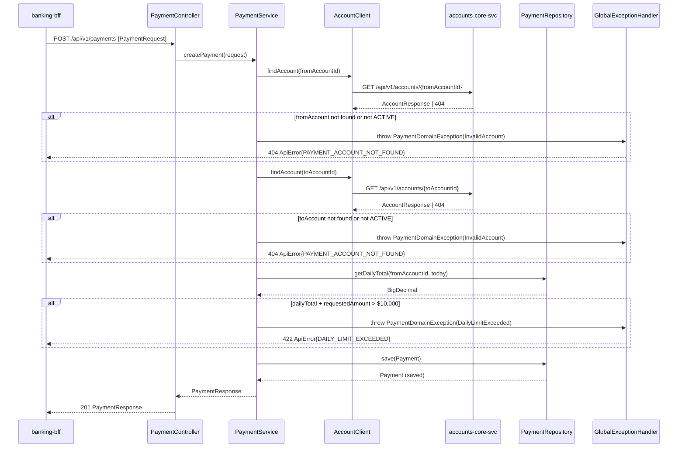

# System Architecture — payments-core-svc

## System Overview

`payments-core-svc` is a Spring Boot 3.3.5 / Kotlin 1.9.25 REST microservice running on port 8082. It is the **authoritative payment processing service** in the DigitalBank platform. It accepts payment requests from `banking-bff`, validates account state by calling `accounts-core-svc`, enforces business risk controls, and owns the payment ledger.

The service currently uses an **in-memory repository** (mock store, 3 pre-seeded payments) in place of a relational database. Codebase comments explicitly note this as a lab/practice implementation intended to be replaced with a JPA-backed repository for production.

There is **no authentication, no relational database, no Kafka, no scheduled jobs, and no third-party payment processor integration** in the current implementation. The sole outbound dependency is `accounts-core-svc` for account validation.

---

## Architecture Diagram



Text Alternative:

```
[banking-bff :8080]
       |
       v
+----------------------------------------------+
|    payments-core-svc (:8082)                 |
|                                              |
|   [PaymentController]                        |
|         |                                    |
|         v                                    |
|   [PaymentService]                           |
|     |            |                           |
|     v            v                           |
| [PaymentRepo]  [AccountClient]               |
|     |                |                       |
|     v                v                       |
| [Payment]    [accounts-core-svc :8081]       |
| (internal)    GET /api/v1/accounts/{id}      |
|                                              |
|   [GlobalExceptionHandler]                   |
|     -> ApiError (banking-contracts)          |
+----------------------------------------------+
       |
       v
[In-Memory MutableMap<String, Payment>]
(3 pre-seeded payments — mock store)
```

---

## Component Descriptions

### PaymentController
- **Purpose**: HTTP REST controller for all payment operations
- **Responsibilities**: Route HTTP requests (`POST /api/v1/payments`, `GET /api/v1/payments/{id}`, `GET /api/v1/payments/account/{accountId}`); delegate to `PaymentService`; return contract types; annotated with SpringDoc/Swagger operation descriptions and response codes
- **Dependencies**: `PaymentService`, `PaymentRequest`, `PaymentResponse` from banking-contracts
- **Type**: Application — Controller

### PaymentService
- **Purpose**: Core business logic for payment creation and retrieval
- **Responsibilities**: Validate source/destination accounts via `AccountClient`; enforce $10,000 daily outbound limit via `PaymentRepository.getDailyTotal()`; create and persist `Payment` domain entities; map internal domain to `PaymentResponse`; throw `PaymentDomainException` on rule violations
- **Dependencies**: `PaymentRepository`, `AccountClient`, `Payment` domain entity, `PaymentDomainException`, contract types from banking-contracts
- **Type**: Application — Service

### PaymentRepository
- **Purpose**: Data access layer (currently in-memory mock)
- **Responsibilities**: `findAll()`, `findById()`, `findByAccountId()`, `save()`, `getDailyTotal(accountId, today)`, `nextId()`; pre-seeded with 3 test payments; daily total uses ISO-8601 date string prefix matching on `createdAt`
- **Dependencies**: `Payment` domain entity, `MonetaryAmount`, `PaymentStatus`, `PaymentType` from banking-contracts
- **Type**: Application — Repository (mock)

### AccountClient
- **Purpose**: HTTP adapter for `accounts-core-svc`; isolates the service layer from HTTP transport concerns
- **Responsibilities**: `findAccount(accountId): AccountResponse?` — calls `GET /api/v1/accounts/{id}` via Spring `WebClient` with `block()` at service boundary; returns null on 404 or any connectivity exception; `isAccountActive(accountId): Boolean` — convenience method for ACTIVE status check
- **Dependencies**: Spring WebFlux `WebClient`, `AccountResponse`, `AccountStatus` from banking-contracts; configured via `accounts-service.base-url` property
- **Type**: Application — HTTP Client

### Payment (domain entity)
- **Purpose**: Internal representation of a payment transaction
- **Responsibilities**: Carries all payment fields; intentionally isolated from the API boundary — always projected to `PaymentResponse` before leaving the service layer
- **Dependencies**: `MonetaryAmount`, `PaymentType`, `PaymentStatus` from banking-contracts
- **Type**: Application — Domain Entity

### PaymentDomainException
- **Purpose**: Runtime wrapper that carries a typed `PaymentError` through Spring's exception chain
- **Responsibilities**: Bridge between domain error type (sealed class from banking-contracts) and Spring MVC exception handling
- **Dependencies**: `PaymentError` sealed class from banking-contracts
- **Type**: Application — Exception

### GlobalExceptionHandler
- **Purpose**: Centralized HTTP error mapping via `@RestControllerAdvice`
- **Responsibilities**: Maps `PaymentDomainException` sub-types to HTTP status codes: `InvalidAccount` → 404, `InsufficientFunds` → 422, `DailyLimitExceeded` → 422; always returns `ApiError` from banking-contracts; generates `traceId` via `UUID.randomUUID()` (not correlated with inbound request headers)
- **Dependencies**: `ApiError`, `PaymentError` from banking-contracts
- **Type**: Application — Exception Handler

---

## Data Flow



Text Alternative:

```
BFF -> PaymentController: POST /api/v1/payments
  -> PaymentService.createPayment()
    -> AccountClient.findAccount(fromAccountId)
       -> accounts-svc: GET /api/v1/accounts/{fromId}
       [null/inactive] -> 404 ApiError{PAYMENT_ACCOUNT_NOT_FOUND}
    -> AccountClient.findAccount(toAccountId)
       -> accounts-svc: GET /api/v1/accounts/{toId}
       [null/inactive] -> 404 ApiError{PAYMENT_ACCOUNT_NOT_FOUND}
    -> PaymentRepository.getDailyTotal(fromId, today)
       [> $10,000] -> 422 ApiError{DAILY_LIMIT_EXCEEDED}
    -> PaymentRepository.save(payment)
    -> return PaymentResponse
  -> 201 PaymentResponse
```

---

## Integration Points

- **External APIs consumed**: `accounts-core-svc` — `GET /api/v1/accounts/{id}` (called twice per payment: once for source account, once for destination account)
- **Databases**: None (in-memory mock; production target is a relational database with JPA)
- **Message brokers**: None (no Kafka, no RabbitMQ)
- **Third-party services**: None (no payment processor, no KYC provider in current implementation)
- **Authentication**: None configured

---

## Infrastructure Components

- **CDK/Terraform**: None
- **Deployment Model**: Spring Boot fat JAR; runs on JVM 17; port 8082
- **Networking**: Inbound HTTP on port 8082; outbound HTTP to `accounts-core-svc` on port 8081 (configurable via `accounts-service.base-url`)
- **API Documentation**: SpringDoc OpenAPI — Swagger UI at `/swagger-ui.html`, JSON spec at `/api-docs`
