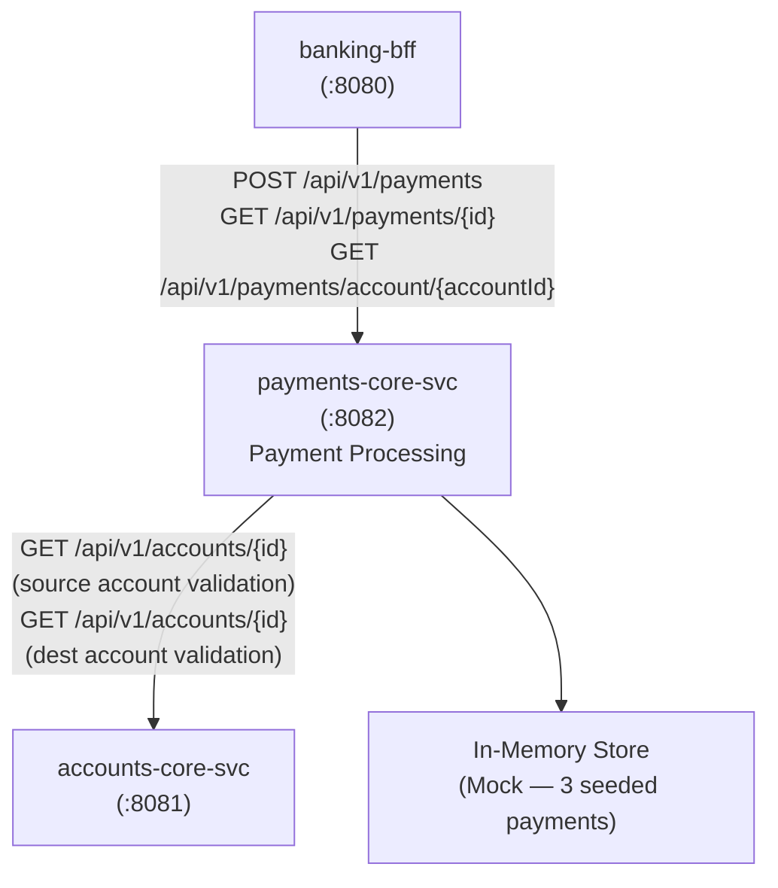

# Business Overview — payments-core-svc

## Business Context Diagram



Text Alternative:

```
[banking-bff :8080]
       |
       v
[payments-core-svc :8082]
       |                   |
       v                   v
[In-Memory Map]    [accounts-core-svc :8081]
(3 seeded payments)  GET /api/v1/accounts/{id}
                     (called twice per payment: source + dest)
```

---

## Business Description

- **Business Description**: `payments-core-svc` is the authoritative service for payment transaction processing within the DigitalBank platform. It orchestrates the full payment lifecycle: validating that both source and destination accounts exist and are eligible (delegating account lookups to `accounts-core-svc`), enforcing a $10,000 daily outbound risk control per source account, and persisting the resulting payment record. It serves as the platform's payment ledger, exposing payment history to the BFF.

- **Business Transactions**:

  | Transaction | Endpoint | HTTP Method | Description |
  |---|---|---|---|
  | Submit a payment | `/api/v1/payments` | POST | Validates accounts, enforces daily limit, creates and persists payment |
  | View payment detail | `/api/v1/payments/{id}` | GET | Returns full payment record by payment ID |
  | List account payments | `/api/v1/payments/account/{accountId}` | GET | Returns all payments where account is source or destination |

- **Business Dictionary**:

  | Term | Meaning in this service |
  |---|---|
  | Payment | Internal domain entity (`Payment` data class) — authoritative record of a financial transfer; never exposed directly at the API boundary |
  | fromAccountId | Source (debited) account — must exist in accounts-core-svc and have status ACTIVE |
  | toAccountId | Destination (credited) account — must exist in accounts-core-svc and have status ACTIVE |
  | Daily Outbound Limit | $10,000 USD per source account per calendar day; enforced at payment creation time by summing `createdAt`-prefixed records |
  | PaymentType | Enum from banking-contracts: `INTERNAL_TRANSFER`, `BILL_PAYMENT` |
  | PaymentStatus | Enum from banking-contracts: `PENDING`, `COMPLETED`; all new payments created with status `COMPLETED` |
  | Reference | Optional free-text memo attached to a payment (e.g., invoice number, split description) |

---

## Component Level Business Descriptions

### PaymentController
- **Purpose**: HTTP entry point for all payment operations; routes requests to service layer; returns typed contract responses
- **Responsibilities**: Accept payment submission, expose payment and account-payment retrieval endpoints, annotated with OpenAPI/Swagger documentation

### Payment (domain entity)
- **Purpose**: Internal representation of a payment transaction; full operational state
- **Responsibilities**: Holds all payment fields; never serialized directly to API responses — always projected to `PaymentResponse` via `PaymentService.toResponse()`

### PaymentService
- **Purpose**: Core business logic orchestrator for payment processing; sole owner of business rules
- **Responsibilities**: Validate source/destination account eligibility via `AccountClient`, enforce $10,000 daily outbound limit, persist payment, map internal domain to API contract types

### PaymentRepository
- **Purpose**: Data access layer; currently an in-memory mock pre-seeded with 3 realistic payments
- **Responsibilities**: CRUD operations, daily total aggregation by source account and calendar day, sequential ID generation

### AccountClient
- **Purpose**: Anti-corruption layer for outbound HTTP calls to `accounts-core-svc`
- **Responsibilities**: Retrieve account state by ID, translate HTTP errors (404, connectivity failures) to null return; provides `isAccountActive()` convenience predicate

### GlobalExceptionHandler
- **Purpose**: Centralized error-to-HTTP mapping
- **Responsibilities**: Maps typed `PaymentError` sealed class variants to appropriate HTTP status codes and `ApiError` response bodies with trace IDs
