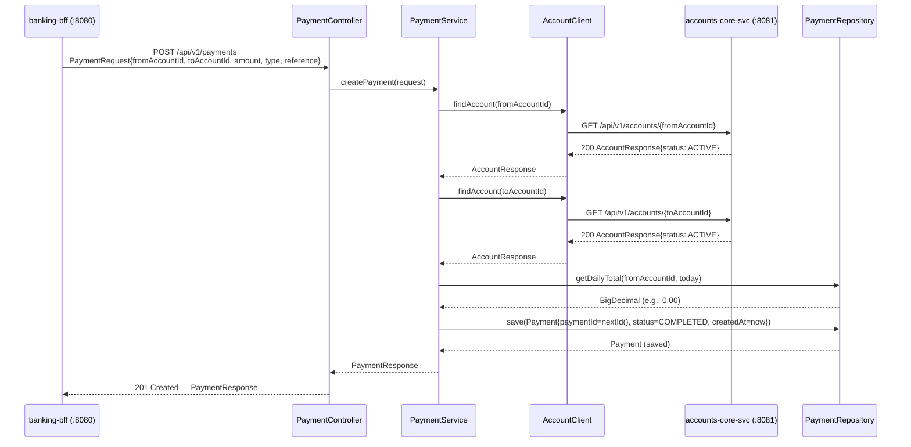
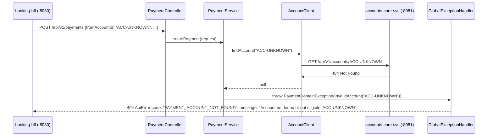
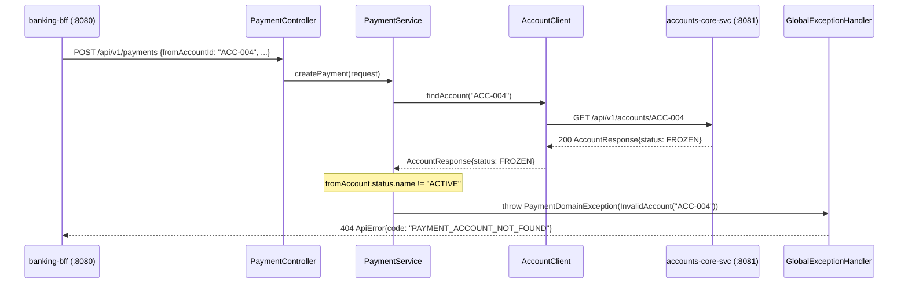
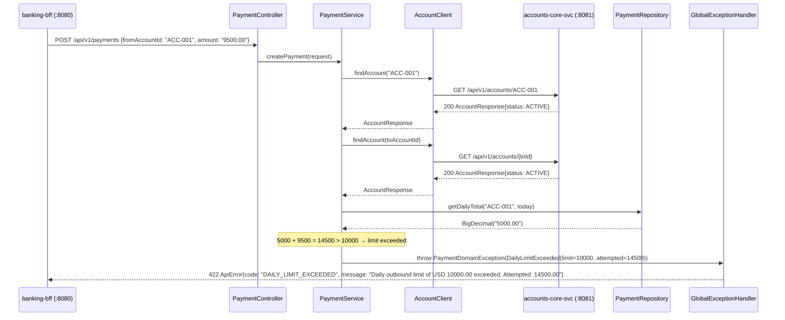
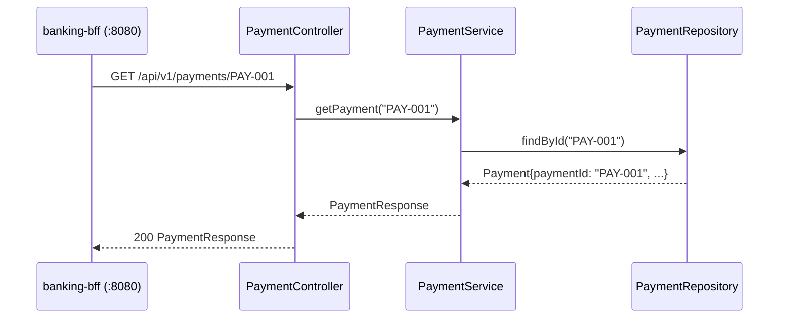
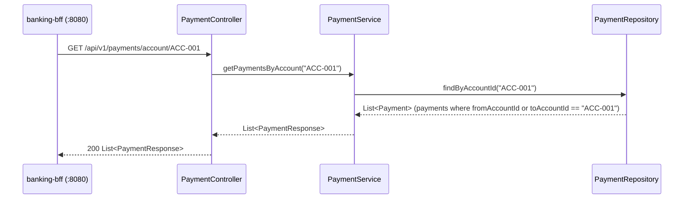
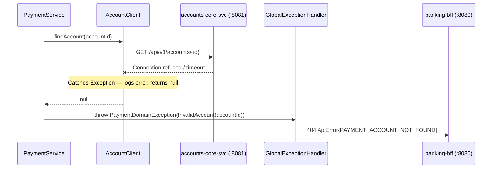

# Interaction Diagrams — payments-core-svc

## Overview

This document depicts how business transactions in `payments-core-svc` are implemented across components and services. The service participates in two cross-service interaction patterns:
1. **Inbound**: Receives HTTP calls from `banking-bff`
2. **Outbound**: Calls `accounts-core-svc` for account validation

---

## Interaction 1: Submit Payment (Happy Path)



Text Alternative:

```
BFF -> PaymentController: POST /api/v1/payments
  -> PaymentService.createPayment()
    [1] AccountClient.findAccount(fromId) -> accounts-svc GET /accounts/{fromId}
        <- AccountResponse {status: ACTIVE}
    [2] AccountClient.findAccount(toId) -> accounts-svc GET /accounts/{toId}
        <- AccountResponse {status: ACTIVE}
    [3] PaymentRepository.getDailyTotal(fromId, today) -> 0.00
    [4] PaymentRepository.save(payment{COMPLETED}) -> saved
    <- PaymentResponse
  <- 201 PaymentResponse
```

---

## Interaction 2: Submit Payment — Source Account Not Found



Text Alternative:

```
BFF -> PaymentController: POST /api/v1/payments {fromAccountId: "ACC-UNKNOWN"}
  -> PaymentService.createPayment()
    AccountClient.findAccount("ACC-UNKNOWN")
    -> accounts-svc: GET /accounts/ACC-UNKNOWN -> 404
    <- null
    throw PaymentDomainException(InvalidAccount)
  GlobalExceptionHandler: 404 ApiError{PAYMENT_ACCOUNT_NOT_FOUND}
```

---

## Interaction 3: Submit Payment — Account Not ACTIVE (e.g., FROZEN)



Text Alternative:

```
BFF -> PaymentController: POST /api/v1/payments {fromAccountId: "ACC-004"}
  -> PaymentService.createPayment()
    AccountClient.findAccount("ACC-004")
    -> accounts-svc: GET /accounts/ACC-004 -> 200 {status: FROZEN}
    <- AccountResponse{status: FROZEN}
    status.name != "ACTIVE" -> throw PaymentDomainException(InvalidAccount)
  GlobalExceptionHandler: 404 ApiError{PAYMENT_ACCOUNT_NOT_FOUND}
```

---

## Interaction 4: Submit Payment — Daily Limit Exceeded



Text Alternative:

```
BFF -> PaymentController: POST /api/v1/payments {fromAccountId: "ACC-001", amount: "9500.00"}
  -> PaymentService.createPayment()
    [accounts validated as ACTIVE]
    PaymentRepository.getDailyTotal("ACC-001", today) -> 5000.00
    5000 + 9500 > 10000 -> throw PaymentDomainException(DailyLimitExceeded)
  GlobalExceptionHandler: 422 ApiError{DAILY_LIMIT_EXCEEDED}
```

---

## Interaction 5: Get Payment by ID



Text Alternative:

```
BFF -> PaymentController: GET /api/v1/payments/PAY-001
  -> PaymentService.getPayment("PAY-001")
    PaymentRepository.findById("PAY-001") -> Payment
    -> toResponse(payment) -> PaymentResponse
  <- 200 PaymentResponse
```

---

## Interaction 6: List Payments for an Account



Text Alternative:

```
BFF -> PaymentController: GET /api/v1/payments/account/ACC-001
  -> PaymentService.getPaymentsByAccount("ACC-001")
    PaymentRepository.findByAccountId("ACC-001")
    -> filter: fromAccountId == "ACC-001" OR toAccountId == "ACC-001"
    -> List<Payment> mapped to List<PaymentResponse>
  <- 200 List<PaymentResponse>
```

---

## Interaction 7: AccountClient Failure (accounts-core-svc Unavailable)



Text Alternative:

```
PaymentService -> AccountClient.findAccount(accountId)
  -> accounts-svc: GET /accounts/{id} -> Exception (timeout/refused)
  catch(Exception) -> log.error(...) -> return null
  <- null
  throw PaymentDomainException(InvalidAccount)
GlobalExceptionHandler: 404 ApiError{PAYMENT_ACCOUNT_NOT_FOUND}

Note: accounts-svc downtime is indistinguishable from account-not-found at the API surface.
No circuit breaker or retry configured.
```
