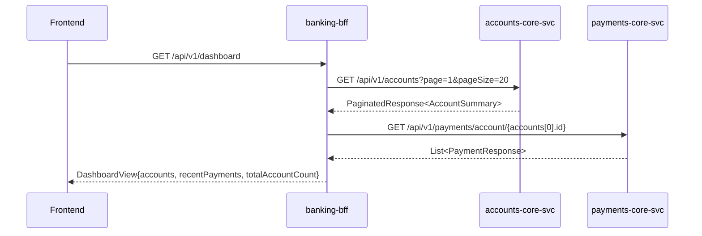
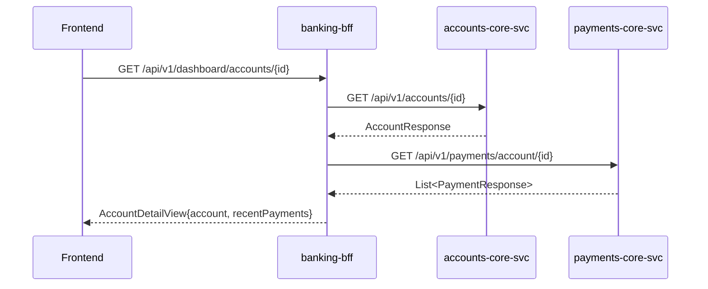
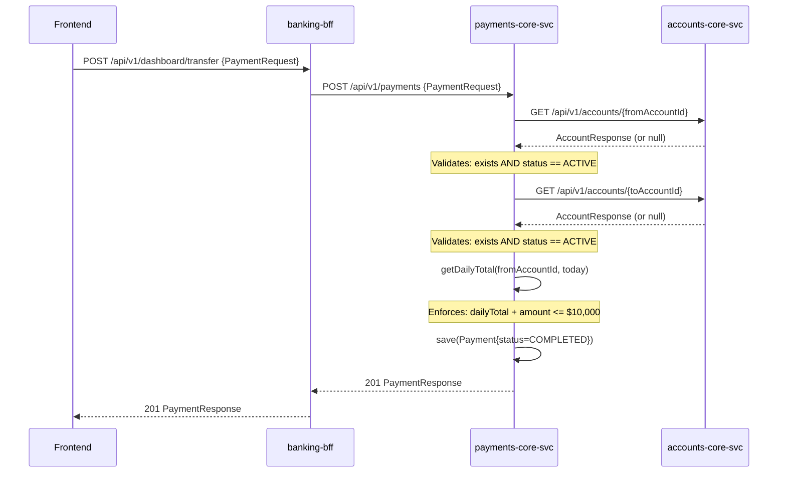
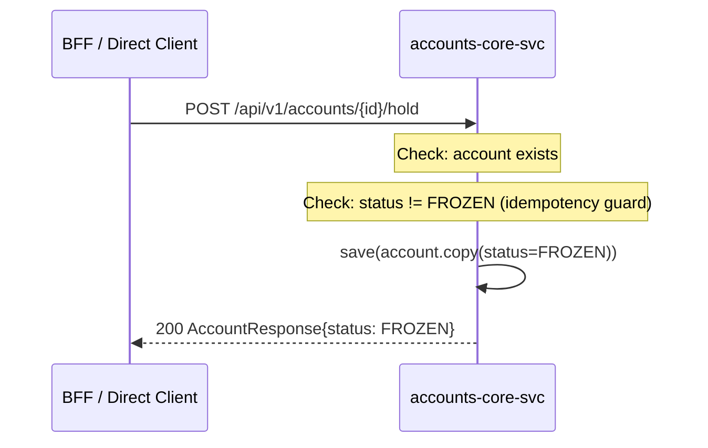

# DigitalBank Platform — Unified Product Architecture

**Synthesized from**: Reverse Engineering across all 4 repositories
**Date**: 2026-03-25
**Scope**: banking-contracts · accounts-core-svc · payments-core-svc · banking-bff

---

## Table of Contents

1. [Platform Overview](#1-platform-overview)
2. [Service Dependency Graph](#2-service-dependency-graph)
3. [Data Flow Diagrams](#3-data-flow-diagrams)
4. [Database Boundaries](#4-database-boundaries)
5. [Event and Messaging Topology](#5-event-and-messaging-topology)
6. [banking-contracts Consumption Map](#6-banking-contracts-consumption-map)
7. [External Integration Points](#7-external-integration-points)
8. [Architectural Patterns](#8-architectural-patterns)
9. [Cross-Cutting Concerns](#9-cross-cutting-concerns)
10. [Identified Gaps and Compliance Findings](#10-identified-gaps-and-compliance-findings)

---

## 1. Platform Overview

DigitalBank is a **multi-repo, microservice-based digital banking platform** composed of four repositories. Three are runtime services; one is a shared contract library.

```
+------------------------------------------------------------------+
|   DigitalBank Platform                                           |
|                                                                  |
|   [banking-bff :8080]      Frontend aggregation layer           |
|         |          |                                             |
|         v          v                                             |
|   [accounts-core-svc :8081]   [payments-core-svc :8082]         |
|   Account management          Payment processing                 |
|         ^                           |                            |
|         |                           v                            |
|         +--- account validation ----+                            |
|                                                                  |
|   All services depend on:                                        |
|   [banking-contracts]  Shared DTOs, errors, enums               |
|   (Gradle composite build — not a deployed service)             |
+------------------------------------------------------------------+
```

| Service | Port | Role | State |
|---|---|---|---|
| `banking-bff` | 8080 | Backend-for-Frontend; aggregates accounts + payments for frontend | Stateless |
| `accounts-core-svc` | 8081 | Authoritative account management service | In-memory mock (5 accounts) |
| `payments-core-svc` | 8082 | Authoritative payment processing service | In-memory mock (3 payments) |
| `banking-contracts` | N/A | Shared contract library: DTOs, enums, error types | Library only |

**Tech stack (uniform across all services)**: Spring Boot 3.3.5 · Kotlin 1.9.25 · Java 17 · Gradle 8.5

---

## 2. Service Dependency Graph

### Dependency Types

```mermaid
graph TD
    FE["Frontend Client"]
    BFF["banking-bff\n(:8080)"]
    AccSvc["accounts-core-svc\n(:8081)"]
    PaySvc["payments-core-svc\n(:8082)"]
    BC["banking-contracts\n(library)"]

    FE -->|HTTP REST| BFF
    BFF -->|HTTP REST\nGET /api/v1/accounts\nGET /api/v1/accounts/{id}| AccSvc
    BFF -->|HTTP REST\nPOST /api/v1/payments\nGET /api/v1/payments/account/{id}| PaySvc
    PaySvc -->|HTTP REST\nGET /api/v1/accounts/{id}\n(account validation)| AccSvc
    BFF -.->|Gradle composite build| BC
    AccSvc -.->|Gradle composite build| BC
    PaySvc -.->|Gradle composite build| BC
```

Text Alternative:

```
[Frontend]  --HTTP-->  [banking-bff :8080]
                            |           |
                       HTTP REST    HTTP REST
                            |           |
                            v           v
               [accounts-core-svc]  [payments-core-svc]
                    :8081                :8082
                      ^                    |
                      |    HTTP REST       |
                      +--------------------+
                      (payment account validation:
                       GET /api/v1/accounts/{id} x2 per payment)

All services <-.Gradle composite build.-> [banking-contracts]
```

### Dependency Matrix

| Caller | Callee | Protocol | Endpoints | Purpose |
|---|---|---|---|---|
| `banking-bff` | `accounts-core-svc` | HTTP REST (WebClient) | `GET /api/v1/accounts`, `GET /api/v1/accounts/{id}` | Account list and detail retrieval |
| `banking-bff` | `payments-core-svc` | HTTP REST (WebClient) | `POST /api/v1/payments`, `GET /api/v1/payments/account/{id}` | Payment submission and history retrieval |
| `payments-core-svc` | `accounts-core-svc` | HTTP REST (WebClient) | `GET /api/v1/accounts/{id}` ×2 per payment | Source and destination account validation |
| `accounts-core-svc` | — | — | — | No outbound service calls |
| All services | `banking-contracts` | Gradle composite build | N/A | Shared DTOs, error types, enums |

### Service Call Frequency by Business Operation

| Operation | accounts-core-svc calls | payments-core-svc calls | Total HTTP hops |
|---|---|---|---|
| GET /api/v1/dashboard | 1 (`listAccounts`) + optionally 0 | 1 (`getPaymentsByAccount`) | 2 |
| GET /api/v1/dashboard/accounts/{id} | 1 (`getAccount`) | 1 (`getPaymentsByAccount`) | 2 |
| POST /api/v1/dashboard/transfer | 2 (from + to validation, via payments-svc) | 1 (`createPayment`) | 3 |
| GET /api/v1/legacy/dashboard | 1 (`listAccounts`) | 0 | 1 |

---

## 3. Data Flow Diagrams

### 3.1 Account Operations

#### List Accounts (Dashboard Load)



Text Alternative:

```
FE -> BFF: GET /api/v1/dashboard
  [1] BFF -> accounts-svc: GET /api/v1/accounts?page=1&pageSize=20
      <- PaginatedResponse<AccountSummary>
  [2] BFF -> payments-svc: GET /api/v1/payments/account/{accounts[0].id}
      <- List<PaymentResponse>  (first account only)
  <- DashboardView{accounts, recentPayments, totalAccountCount}
```

#### Account Detail with Payment History



Text Alternative:

```
FE -> BFF: GET /api/v1/dashboard/accounts/{id}
  [1] BFF -> accounts-svc: GET /api/v1/accounts/{id}
      <- AccountResponse (or null -> 404)
  [2] BFF -> payments-svc: GET /api/v1/payments/account/{id}
      <- List<PaymentResponse>
  <- AccountDetailView{account, recentPayments}
```

### 3.2 Payment Flow (Full System Path)



Text Alternative:

```
FE -> BFF: POST /api/v1/dashboard/transfer {PaymentRequest}
BFF -> payments-svc: POST /api/v1/payments {PaymentRequest}
  [1] payments-svc -> accounts-svc: GET /accounts/{fromAccountId}
      validate: exists + ACTIVE
  [2] payments-svc -> accounts-svc: GET /accounts/{toAccountId}
      validate: exists + ACTIVE
  [3] payments-svc: getDailyTotal(fromId, today) <= $10,000
  [4] payments-svc: save(Payment{COMPLETED})
  <- 201 PaymentResponse
BFF -> FE: 201 PaymentResponse
```

### 3.3 Account Hold Operation



Text Alternative:

```
Caller -> accounts-svc: POST /api/v1/accounts/{id}/hold
  validate: account exists
  validate: status != FROZEN (idempotency guard)
  save account with status = FROZEN
  <- 200 AccountResponse{status: FROZEN}
```

---

## 4. Database Boundaries

### Current State (Lab / In-Memory)

| Service | Storage | Type | Contents | Production Target |
|---|---|---|---|---|
| `accounts-core-svc` | `MutableMap<String, Account>` | In-memory | 5 pre-seeded accounts (ACC-001 to ACC-005) | Relational DB with JPA (explicitly noted in code comments) |
| `payments-core-svc` | `MutableMap<String, Payment>` | In-memory | 3 pre-seeded payments (PAY-001 to PAY-003) | Relational DB with JPA (explicitly noted in code comments) |
| `banking-bff` | None | Stateless | — | Stateless (BFF has no persistence requirement) |
| `banking-contracts` | None | Library | — | N/A |

### Ownership Boundaries (Target Architecture)

```
accounts-core-svc
  └── accounts table     (accountId, accountType, holderName, balance, currency,
                          status, internalRiskScore, kycVerified, createdBy, openedAt)
      PRIVATE — not directly accessible by any other service

payments-core-svc
  └── payments table     (paymentId, fromAccountId, toAccountId, amount, currency,
                          type, status, reference, createdAt)
      PRIVATE — not directly accessible by any other service

Cross-service account references in payments table:
  payments.fromAccountId → NOT a FK to accounts table (different DB boundary)
  payments.toAccountId   → NOT a FK to accounts table (different DB boundary)
  Referential integrity enforced at runtime via HTTP call, not at DB level
```

### Key Observations

- **No shared database**: Each service owns its data exclusively. Cross-service data is accessed only via HTTP. This is correct microservice data isolation.
- **No Flyway or Liquibase**: No database migration tooling configured in any service. Required before any relational DB is introduced.
- **No `@Transactional`**: Absent from all services. Not applicable today (no DB), but must be added with JPA migration. The payment creation flow (2 account validations + 1 save) has no distributed transaction protection.
- **Daily limit uses string-prefix date matching**: `PaymentRepository.getDailyTotal()` matches `createdAt.startsWith("YYYY-MM-DD")` — a UTC-correctness assumption that must be replaced with a proper date-range query under JPA.

---

## 5. Event and Messaging Topology

### Current State

```
Kafka Producers:   NONE
Kafka Consumers:   NONE
Message Brokers:   NONE
Scheduled Jobs:    NONE
Event Publishing:  NONE
```

**There is no event-driven architecture in the current platform.** All inter-service communication is synchronous HTTP. All business state changes (payment created, account frozen) are local in-memory writes with no outbound event publication.

### Gap Analysis Against Expected Fintech Event Topology

The following events are **expected in a production payment platform** but are absent:

| Expected Event | Trigger | Expected Producer | Expected Consumers | Current State |
|---|---|---|---|---|
| `payment.created` | `POST /api/v1/payments` succeeds | `payments-core-svc` | Audit service, notification service, fraud detection | **Absent** |
| `payment.failed` | Validation fails in `createPayment()` | `payments-core-svc` | Fraud detection, alerting | **Absent** |
| `account.frozen` | `POST /api/v1/accounts/{id}/hold` succeeds | `accounts-core-svc` | Notification service, compliance | **Absent** |
| `account.created` | Account provisioning (not yet implemented) | `accounts-core-svc` | KYC service, onboarding | **Not implemented** |
| `daily.limit.exceeded` | `DailyLimitExceeded` error thrown | `payments-core-svc` | Fraud detection, alerting | **Absent** |

### Saga / Distributed Transaction Observation

The payment creation flow involves three logical steps across two services that are **not atomically coordinated**:

```
Step 1: Validate fromAccount  (accounts-core-svc)
Step 2: Validate toAccount    (accounts-core-svc)
Step 3: Save payment record   (payments-core-svc)
```

If step 3 fails after steps 1 and 2 succeed, there is no compensating transaction or rollback mechanism. No saga pattern is implemented. This is acceptable in the lab context but is a production risk for any stateful persistence layer.

---

## 6. banking-contracts Consumption Map

### Library Overview

`banking-contracts` is a Gradle composite build dependency (not a published Maven artifact) consumed by all three runtime services via `includeBuild("../banking-contracts")`. It defines the shared contract language for the entire platform.

### Type Consumption by Service

#### Account Domain Types

| Contract Type | Package | accounts-core-svc | payments-core-svc | banking-bff |
|---|---|---|---|---|
| `AccountResponse` | `contracts.accounts` | **Owns** (maps from internal `Account`) | Receives via `AccountClient` | Passes through in `AccountDetailView` |
| `AccountSummary` | `contracts.accounts` | **Owns** (maps from internal `Account`) | Not used | Passes through in `DashboardView` |
| `AccountStatus` | `contracts.accounts` | **Owns** (status field of `Account`) | Used for ACTIVE check in `AccountClient` | Not used directly |
| `AccountType` | `contracts.accounts` | **Owns** (type field of `Account`) | Not used | Not used directly |
| `AccountError` | `contracts.accounts` | **Owns** (throws in `AccountController`) | Not used | Not used |

#### Payment Domain Types

| Contract Type | Package | accounts-core-svc | payments-core-svc | banking-bff |
|---|---|---|---|---|
| `PaymentRequest` | `contracts.payments` | Not used | **Receives** (inbound DTO) | Forwards from frontend |
| `PaymentResponse` | `contracts.payments` | Not used | **Owns** (maps from internal `Payment`) | Passes through as response |
| `PaymentError` | `contracts.payments` | Not used | **Throws** (InvalidAccount, DailyLimitExceeded) | Surfaces as `UPSTREAM_ERROR` |
| `PaymentStatus` | `contracts.payments` | Not used | **Owns** (COMPLETED on creation) | Not used directly |
| `PaymentType` | `contracts.payments` | Not used | **Owns** (INTERNAL_TRANSFER, BILL_PAYMENT) | Not used directly |

#### Common Types

| Contract Type | Package | accounts-core-svc | payments-core-svc | banking-bff |
|---|---|---|---|---|
| `MonetaryAmount` | `contracts.common` | Used in `Account.balance` | Used in `Payment.amount`, `DailyLimitExceeded` | Used transitively |
| `ApiError` | `contracts.common` | **Returns** in `GlobalExceptionHandler` | **Returns** in `GlobalExceptionHandler` | **Returns** in `GlobalExceptionHandler` |
| `PaginatedResponse<T>` | `contracts.common` | **Returns** from `GET /api/v1/accounts` | Not used | Receives from `AccountServiceClient` |

### Contract Ownership Observations

- **`AccountResponse` and `AccountSummary`** are owned by `accounts-core-svc` at runtime (only it populates them from a data store), but defined in a neutral shared library. This is correct — the contract library is not owned by any single service.
- **`PaymentError.InsufficientFunds`** is defined in banking-contracts and handled in `payments-core-svc`'s `GlobalExceptionHandler`, but is **never thrown** by `PaymentService`. It is a forward-compatibility stub.
- **`banking-contracts` version is unpinned** — all services resolve it via local composite build with no published version coordinate. There is no versioning strategy for breaking contract changes. A change to any contract type in `banking-contracts` immediately affects all three services at the next build.

---

## 7. External Integration Points

### Current State

```
Payment Processors (Visa, Mastercard, Stripe, etc.):   NONE
KYC / Identity Verification Providers:                 NONE
Core Banking Systems (CBS):                            NONE
Fraud Detection Services:                              NONE
Notification Services (email, SMS, push):              NONE
Secrets Managers (Vault, AWS Secrets Manager):         NONE
Service Discovery (Eureka, Consul, K8s DNS):           NONE
Observability Backends (Datadog, Dynatrace, Grafana):  NONE
CDN / API Gateways:                                    NONE
```

**The platform has zero external integration points.** All service-to-service communication is internal (localhost). This is consistent with its lab/training purpose.

### Expected Production Integrations (Absent)

| Integration Category | Expected Component | Impacted Services | Notes |
|---|---|---|---|
| Payment Network | Payment processor (e.g., Stripe, Adyen) | `payments-core-svc` | Real payment execution not implemented |
| Identity / KYC | KYC provider | `accounts-core-svc` | `kycVerified` field exists in domain model but is never populated via external call |
| Secrets Management | Vault / AWS Secrets Manager | All services | Service URLs hardcoded to localhost |
| Observability | APM / metrics backend | All services | No Actuator, no Micrometer |
| API Gateway | Kong / AWS API Gateway | `banking-bff` | No rate limiting, no auth enforcement |
| Message Broker | Apache Kafka | All services | No event-driven patterns implemented |

---

## 8. Architectural Patterns

### 8.1 Patterns Present

#### Layered Architecture (All Services)
All three runtime services follow a strict Controller → Service → Repository / Client layering. No cross-layer shortcuts are present. The pattern is consistent across the platform.

```
[Controller]          HTTP boundary — request routing, response shaping
      |
[Service]             Business rules — validation, orchestration, error throwing
      |
[Repository / Client] Data access — in-memory store OR outbound HTTP adapter
```

#### Anti-Corruption Layer at API Boundary (All Services)
Internal domain models are never serialized directly to API responses. Each service maintains a strict projection boundary:

| Service | Internal Domain | Projection Mechanism | Output Contract Type |
|---|---|---|---|
| `accounts-core-svc` | `Account` (with internal fields) | `AccountMapper.toAccountResponse()`, `toAccountSummary()` | `AccountResponse`, `AccountSummary` |
| `payments-core-svc` | `Payment` | `PaymentService.toResponse()` (private) | `PaymentResponse` |
| `banking-bff` | — | `DashboardView`, `AccountDetailView` (wrappers only) | Contract types pass-through |

Internal-only fields that are explicitly suppressed from API responses:
- `Account.internalRiskScore` — never in any API response
- `Account.kycVerified` — never in any API response
- `Account.createdBy` — never in any API response

#### Typed Error Handling via Sealed Classes (All Services)
All services use sealed class error hierarchies from banking-contracts:

```
AccountError (sealed) → AccountDomainException → GlobalExceptionHandler → ApiError
  ├── AccountError.NotFound(accountId)            → HTTP 404
  ├── AccountError.AlreadyFrozen(accountId)       → HTTP 422
  └── AccountError.InsufficientFunds(accountId)   → HTTP 422

PaymentError (sealed) → PaymentDomainException → GlobalExceptionHandler → ApiError
  ├── PaymentError.InvalidAccount(accountId)      → HTTP 404
  ├── PaymentError.InsufficientFunds(accountId)   → HTTP 422
  └── PaymentError.DailyLimitExceeded(limit, attempted) → HTTP 422
```

This is a production-grade error model: exhaustive at compile time, no `else` fallback, fully typed at every layer.

#### BFF Aggregation Pattern (`banking-bff`)
`banking-bff` implements the Backend-for-Frontend pattern: it owns view composition (which data fields appear together for a given screen) but delegates all data ownership to core services. BFF-owned types (`DashboardView`, `AccountDetailView`) are pure structural wrappers with no data fields of their own.

#### Composite Build Dependency (All Services → `banking-contracts`)
All services resolve `banking-contracts` via Gradle composite build (`includeBuild("../banking-contracts")`). This enforces monorepo co-location and ensures all services always use the same version of contracts. The trade-off: no independent versioning, no published artifact, and all services are coupled to the same build workspace.

#### Teaching / Dual-Pattern Contrast (`banking-bff`)
`banking-bff` uniquely contains both a clean reference implementation (`clean/`) and a deliberately anti-pattern implementation (`legacy/`) side by side. This is an intentional training artifact with no production equivalent.

### 8.2 Patterns Absent (Expected for Production)

| Pattern | Status | Impact |
|---|---|---|
| **CQRS** | Absent | All services use the same model for reads and writes; no read/write model separation |
| **Event Sourcing** | Absent | State changes are in-memory mutations, not event-log projections |
| **Saga / Distributed Transaction** | Absent | Payment creation spans 2 services with no compensating transaction |
| **Circuit Breaker** | Absent | No Resilience4j; upstream failure propagates as null/empty or exception |
| **Retry with Backoff** | Absent | All WebClient calls are single-attempt |
| **Idempotency Keys** | Absent | `POST /api/v1/payments` has no idempotency mechanism — duplicate requests create duplicate payments |
| **Outbox Pattern** | Absent | No transactional event publishing; would be needed when Kafka is introduced |
| **API Versioning** | Present in path (`/api/v1/`) | Versioned path prefix exists but no versioning lifecycle strategy |

---

## 9. Cross-Cutting Concerns

### 9.1 Authentication and Authorization

**Current state: Entirely absent across the full platform.**

```
Frontend → banking-bff           No authentication
banking-bff → accounts-core-svc  No authentication, no token forwarding
banking-bff → payments-core-svc  No authentication, no token forwarding
payments-core-svc → accounts-core-svc  No authentication
```

No Spring Security configuration exists in any service. No JWT validation, no OAuth2 resource server configuration, no API key enforcement. All endpoints on all services are publicly accessible.

**Identity flow (target architecture, not yet implemented)**:

```
[Frontend] --Bearer JWT--> [banking-bff]
                                |
                         Extract user identity
                                |
               +----------------+----------------+
               v                                 v
   [accounts-core-svc]               [payments-core-svc]
   (forwarded JWT or                 (forwarded JWT or
    service-to-service token)         service-to-service token)
```

### 9.2 Error Handling Patterns

Error handling follows a consistent pattern in the core services but breaks down at the BFF layer:

**Core Services (consistent)**:
```
Business rule violation
  → throw DomainException(SealedClassError)
  → GlobalExceptionHandler catches
  → Maps to HTTP status + ApiError{code, message, traceId, timestamp}
```

**banking-bff (inconsistent)**:
```
accounts-core-svc failure (listAccounts):  silently returns empty data (200 with no accounts)
accounts-core-svc failure (getAccount):    returns null → 404 ApiError
payments-core-svc failure (submitPayment): propagates as WebClientResponseException
  → GlobalExceptionHandler → 422/404 ApiError{code: "UPSTREAM_ERROR"}
  → Domain error type LOST (DAILY_LIMIT_EXCEEDED, INVALID_ACCOUNT → both become "UPSTREAM_ERROR")
payments-core-svc failure (getPayments):   silently returns empty list
```

The BFF is the weakest link in error propagation. Domain error context from payments-core-svc is systematically discarded.

### 9.3 Logging

| Concern | accounts-core-svc | payments-core-svc | banking-bff |
|---|---|---|---|
| Structured logging | Absent | Absent | Absent |
| Request/response logging | Absent | Absent | Absent |
| Error logging | Absent | `AccountClient`: log.error on connectivity failure | Both clients: log.error on failure |
| Audit logging (business events) | **Absent** | **Absent** | N/A |
| Correlation ID / traceId | Per-error UUID only (not propagated) | Per-error UUID only (not propagated) | Per-error UUID only (not propagated) |

No distributed tracing infrastructure (no Micrometer Tracing, no Zipkin, no W3C `traceparent` header propagation). Each service generates isolated `traceId` values in error responses — these are not correlated across service hops.

### 9.4 Observability

| Capability | Status |
|---|---|
| Spring Actuator | Absent in all services |
| Health endpoints | Absent |
| Metrics (Prometheus/Micrometer) | Absent |
| Distributed tracing | Absent |
| Structured log shipping | Absent |
| Alerting | Absent |

### 9.5 Resilience

All inter-service HTTP calls use Spring WebFlux `WebClient` with `.block()` (synchronous invocation). No resilience patterns are configured on any client:

| Resilience Feature | accounts-core-svc | payments-core-svc (AccountClient) | banking-bff (both clients) |
|---|---|---|---|
| Connection timeout | Not configured | Not configured | Not configured |
| Read timeout | Not configured | Not configured | Not configured |
| Circuit breaker | N/A (no outbound) | Absent | Absent |
| Retry | N/A | Absent | Absent |
| Fallback | N/A | null return | Empty data return (partial) |

**Failure blast radius**: If `accounts-core-svc` goes down:
- All `payments-core-svc` payment creation requests fail (accounts unresolvable → null → 404)
- `banking-bff` dashboard returns empty accounts (200 with no data — silent failure)
- `banking-bff` account detail returns 404 (correct, but accounts-svc unavailability is indistinguishable from account-not-found)

### 9.6 Configuration Management

All service-to-service URLs are hardcoded to `localhost` in `application.yml`:

| Property | Service | Default Value | Issue |
|---|---|---|---|
| `accounts-service.base-url` | `payments-core-svc`, `banking-bff` | `http://localhost:8081` | Not suitable for containerized deployment |
| `payments-service.base-url` | `banking-bff` | `http://localhost:8082` | Not suitable for containerized deployment |

No secrets management, no environment-specific config profiles, no service discovery. All three services must run on the same host in the default configuration.

---

## 10. Identified Gaps and Compliance Findings

Findings are assessed against the enabled **security-baseline** extension and standard fintech production requirements.

### 10.1 Security Baseline Findings

| ID | Control | Finding | Severity | Affected Services |
|---|---|---|---|---|
| SEC-01 | Encryption at Rest | No database → N/A for data at rest today. No HTTPS/TLS enforcement configured — relies on network-level control | HIGH | All |
| SEC-03 | Application-Level Logging | No application-level audit logging of any business events (payments created, accounts frozen, failed access attempts) | **CRITICAL** | All |
| SEC-04 | HTTP Security Headers | No security headers configured: no `X-Frame-Options`, `X-Content-Type-Options`, `Strict-Transport-Security`, `Content-Security-Policy` | HIGH | All |
| SEC-05 | Input Validation | No `@Valid` or `@NotBlank` on any request body across any controller. Malformed inputs are either forwarded to downstream services or cause unexpected runtime errors | HIGH | All |
| SEC-08 | Application-Level Access Control | No authentication or authorization on any endpoint across any service. Any network-reachable client can read all accounts, all payments, create payments, and freeze accounts | **CRITICAL** | All |
| SEC-09 | Security Hardening | No Spring Actuator security hardening. Default Spring Boot error page active. No suppression of server version headers | MEDIUM | All |
| SEC-10 | Software Supply Chain | No SBOM, no dependency scanning, no pinned dependency versions in banking-contracts (consumed services cannot verify contract library integrity) | HIGH | All |
| SEC-12 | Authentication & Credential Management | No authentication mechanism. No credential management. Service-to-service calls are unauthenticated | **CRITICAL** | All |
| SEC-14 | Alerting and Monitoring | No monitoring, no alerting, no health checks, no SLO instrumentation | HIGH | All |

### 10.2 Fintech Compliance Gaps

#### Audit Trail
No immutable audit log of any business-relevant event. The following operations have zero record:
- Payment created / failed
- Account frozen
- Daily limit reached
- All failed access attempts

**Regulatory risk**: Most banking jurisdictions (PCI-DSS, ISO 27001, local banking laws) mandate immutable audit trails for all financial transactions.

#### PII Handling
PII fields present in the platform with no protection controls:

| Field | Location | PII Type | Risk |
|---|---|---|---|
| `Account.holderName` | `accounts-core-svc` | Full name | Returned in `AccountSummary` on every list call — no masking |
| `Account.internalRiskScore` | `accounts-core-svc` | Sensitive internal scoring | Correctly suppressed at API boundary — but stored in plain in-memory map |
| `Account.kycVerified` | `accounts-core-svc` | Identity verification status | Correctly suppressed at API boundary |
| Payment amounts | `payments-core-svc` | Financial data | Unmasked in all API responses |
| Account IDs in payment records | `payments-core-svc` | Linkable identity data | No pseudonymization |

#### Idempotency
`POST /api/v1/payments` has no idempotency key mechanism. Duplicate POST requests (network retry, double-click) will create multiple payment records with different IDs but identical business content. No deduplication exists at the service or client layer.

#### Daily Limit Implementation Fragility
The $10,000 daily outbound limit in `payments-core-svc` has three implementation risks:

| Risk | Detail |
|---|---|
| Not thread-safe | `PaymentRepository.getDailyTotal()` reads and `save()` writes are not atomic — concurrent requests can bypass the limit via a race condition |
| UTC-only | Date string prefix matching assumes all `createdAt` timestamps are UTC; timezone misconfiguration breaks the limit |
| Not durable | In-memory store is lost on restart — daily totals reset on every service restart |

#### Missing Functional Capabilities (Business Gaps)

| Gap | Description |
|---|---|
| Account balance enforcement | `PaymentService` validates accounts are ACTIVE but does not check whether `fromAccount.balance >= payment.amount` — `PaymentError.InsufficientFunds` is defined and handled but never thrown |
| Dashboard payments completeness | `GET /api/v1/dashboard` fetches payments for the first account in the list only — all other accounts' recent payments are absent from the dashboard view |
| Payment status lifecycle | All payments are created with `status = COMPLETED` immediately — no `PENDING` → `PROCESSING` → `COMPLETED`/`FAILED` lifecycle |
| Pagination on payment history | `GET /api/v1/payments/account/{id}` returns all payments with no pagination — unbounded response for accounts with large payment history |
| Account creation | No `POST /api/v1/accounts` endpoint — accounts exist only as pre-seeded mock data |

### 10.3 Production Readiness Summary

| Dimension | Score | Blocking Issues |
|---|---|---|
| Security — Authentication | ★☆☆☆☆ | No auth anywhere; CRITICAL |
| Security — Audit Logging | ★☆☆☆☆ | No business event logging; CRITICAL |
| Security — Input Validation | ★☆☆☆☆ | No validation on any API endpoint; HIGH |
| Resilience | ★☆☆☆☆ | No timeout, circuit breaker, or retry; HIGH |
| Observability | ★☆☆☆☆ | No health checks, metrics, or tracing; HIGH |
| Data Persistence | ★☆☆☆☆ | In-memory only; data lost on restart; HIGH |
| Contract Architecture | ★★★★★ | Excellent — consistent, typed, anti-corruption boundary enforced |
| Code Structure | ★★★★☆ | Clean layering, domain isolation, typed errors |
| API Design | ★★★★☆ | Consistent REST conventions, OpenAPI documented |
| Business Logic | ★★★☆☆ | Core rules present; insufficient funds unimplemented; idempotency absent |

---

*Generated by AI-DLC Reverse Engineering Phase — DigitalBank Platform*
*Source: aidlc-docs/inception/reverse-engineering/ (banking-contracts, accounts-core-svc, payments-core-svc, banking-bff)*
